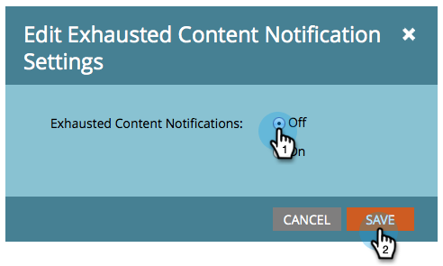

# 停用及啟用已用完的內容通知 {#disable-and-enable-exhausted-content-notifications}

當人們耗盡串流中的所有內容時，Marketo可以傳送通知給您。 您可以根據需求停用/啟用通知。 方法如下。

1. 前往 **行銷活動**.

   

1. 選取參與計畫並按一下 **設定** 標籤。

   

1. 按兩下 **已用完的內容通知**.

   

1. 選取 **關閉** (或 **開啟**)並按一下 **儲存**.

   

   超級！ 如果您啟用通知，將會在資料流本身看到一些內容，並收到電子郵件通知。
