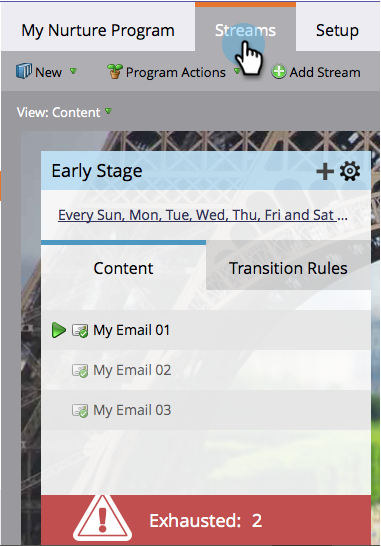

# 已耗盡內容的人 {#people-who-have-exhausted-content}

當使用者收到資料流中的所有內容時，已用盡所有可能性，並會等待空閒，直到新增更多內容為止。 你可以從幾個方面找到「筋疲力盡」的人。

## 參與計畫篩選器的成員 {#member-of-engagement-program-filter}

1. 建立新的智慧清單，然後尋找並拖曳 **參與計畫成員** 篩選。

   

1. 查找並選擇要在其中查找精疲力竭人員的參與方案。

   

1. 在 **添加約束**，選取 **已用盡的內容**.

   

1. 設定 **已用盡的內容** to **true**.

   

   只要執行這個智慧清單，即可查看已耗盡其所在資料流中所有內容的使用者清單。

## 成員頁簽 {#members-tab}

1. 前往 **行銷活動**.

   

1. 選取您的參與方案，然後前往 **成員** 標籤。

   

1. 請注意，名為 **已用盡的內容**.

   

   這顯示已耗盡所有內容的人和尚未耗盡內容的人。

## 資料流 {#stream}

1. 您也可以在資料流本身的「資料流」標籤下，查看已用盡內容的總人數。

   

   >[!NOTE]
   >
   >此數字會在每次轉播後立即更新。
