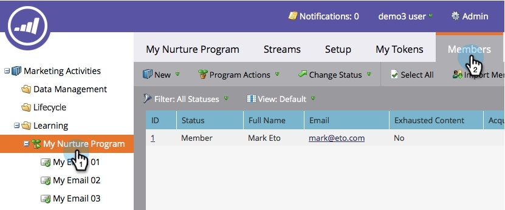

# 內容已耗竭的人 {#people-who-have-exhausted-content}

當個人收到資料流中的每段內容時，就會用盡所有可能性，並等候閒置直到新增更多內容。 您可以找到在多種方式中「精疲力盡」的人。

## 參與計畫篩選的成員 {#member-of-engagement-program-filter}

1. 建立新的智慧清單，然後在 **參與計畫會員** 篩選。

   

1. 尋找並選取要在其中尋找疲憊人員的參與計畫。

   

1. 下 **新增限制**，選取 **內容已耗盡**.

   

1. 設定 **內容已耗盡** 至 **true**.

   

   只要執行此智慧清單，即可檢視已用盡其所在資料流中所有內容的人員清單。

## 「成員」標籤 {#members-tab}

1. 前往 **行銷活動**.

   

1. 選取您的參與計畫，然後前往 **成員** 標籤。

   

1. 請注意名為的欄 **內容已耗盡**.

   

   這會向您顯示已用盡所有內容的人和未用盡所有內容的人。

## 資料流 {#stream}

1. 您也可以檢視在串流本身的「串流」索引標籤下已用完內容的總人數。

   

   >[!NOTE]
   >
   >此數字將在每次轉換後立即更新。
