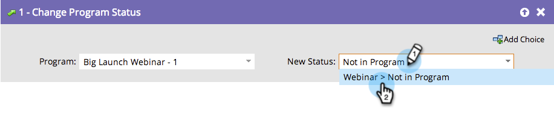

# 從項目計畫{#remove-a-member-from-an-engagement-program}中刪除成員

糟了！ 那些人是怎麼進來的？ 您可以使用&#x200B;**更改程式狀態**&#x200B;流程步驟從參與程式中刪除成員。

>[!TIP]
>
>請勿使用此功能來暫停個人的內容。 這將消除分析中的所有歸因。 進一步瞭解如何在參與計畫中暫停人員](/help/marketo/product-docs/email-marketing/drip-nurturing/using-engagement-programs/pause-people-in-an-engagement-program.md)。[

## 流程步驟{#flow-step}

1. 在&#x200B;**更改程式狀態**&#x200B;流步驟中拖動。

   

   選擇狀態&#x200B;**Not in Program**。

   

   太棒了。 您在[smart list](/help/marketo/product-docs/core-marketo-concepts/smart-lists-and-static-lists/creating-a-smart-list/create-a-smart-list.md)中定義的所有成員將不再參與此項目計畫。

## 暫停人員{#pause-people}

有時候，您只想在參與計畫中暫停人員，而不是移除他們。 這是使用&#x200B;**變更參與計畫Cadence**&#x200B;完成的。

>[!MORELIKETHIS]
>
>[暫停參與計畫中的人員](/help/marketo/product-docs/email-marketing/drip-nurturing/using-engagement-programs/pause-people-in-an-engagement-program.md)
