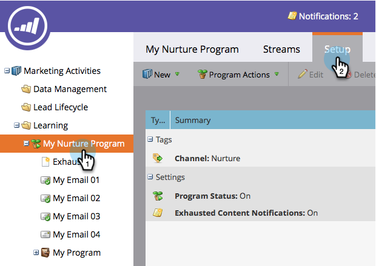

# 開啟和關閉參與計畫 {#turn-an-engagement-program-on-and-off}

只要輕輕一下開關，就可以關閉訂閱程式。 這會阻止任何內容傳出。 這是方法。

1. 前往 **行銷活動**.

   

1. 選取參與方案，然後按一下 **設定**.

   >[!NOTE]
   >
   >除非您超過訂閱限制，否則預設會開啟參與計畫。

   

1. 按兩下 **方案狀態**.

   

1. 選擇 **關閉** 按一下 **儲存**.

   

給你！ 您可以使用相同的步驟重新開啟它。
