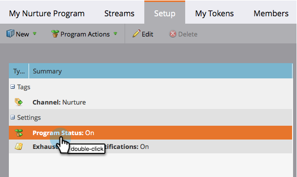

# 開啟和關閉參與計畫 {#turn-an-engagement-program-on-and-off}

只要按一下開關，您就可以關閉參與計畫。 這樣會停止傳送任何內容。 方法如下。

1. 移至&#x200B;**行銷活動**。

   

1. 選取參與方案並按一下&#x200B;**設定**。

   >[!NOTE]
   >
   >除非您已超出訂閱限制，否則參與計畫預設為啟用。

   

1. 連按兩下&#x200B;**程式狀態**。

   

1. 選取&#x200B;**關閉**&#x200B;並按一下&#x200B;**儲存**。

   

好了！ 您可以使用相同的步驟將其重新開啟。
