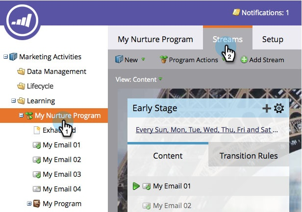

# 優先處理串流內容 {#prioritize-stream-content}

將內容新增至串流後，您可能想要變更優先順序。 每次播放的內容一律由上而下傳送，不會將任何內容傳送給同一個人兩次。

1. 前往 **行銷活動**.

   

1. 選取您的參與方案，然後按一下 **串流** 標籤。

   

1. 現在，只要將內容拖放至您想要的順序即可。

   

   >[!NOTE]
   >
   >在轉換時，優先順序一律會從上到下讀取。

   這太簡單了！ 現在您知道如何排定串流內容的優先順序了。
