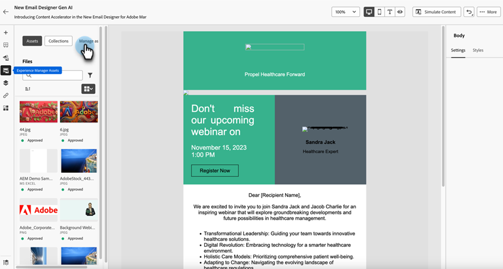

# 使用Experience Manager資產 {#work-with-experience-manager-assets}

將您的&#x200B;_Adobe Experience Manager Assetsas a Cloud Service_&#x200B;帳戶連線至您的Adobe Marketo Engage執行個體，以便在Marketo Engage電子郵件Designer中善用您的AEM資產存放庫。

>[!NOTE]
>
>目前，Marketo Engage僅支援來自&#x200B;_Adobe Experience Manager Assets_&#x200B;的影像資產。 必須從Adobe Experience Manager Assets中央存放庫變更資產。 [了解更多](https://experienceleague.adobe.com/zh-hant/docs/experience-manager-cloud-service/content/assets/manage/manage-digital-assets){target="_blank"}

## 存取 AI 助理內容加速器 {#access-the-ai-assistant-content-accelerator}

您必須先將AEMCloud Service與Adobe Marketo Engage連結，才能使用此功能。

+++連結AEMCloud Service和Marketo Engage

>[!NOTE]
>
>**需要管理員許可權**

1. 在Marketo Engage中，移至&#x200B;**管理員**&#x200B;區域並在左側導覽樹狀結構中選取&#x200B;**Adobe Experience Manager**。

   {width="800" zoomable="yes"}

1. 按一下&#x200B;_Adobe Experience ManagerCloud Service_&#x200B;旁的&#x200B;**編輯**。

   ![按一下[編輯]](assets/access-the-ai-assistant-content-accelerator-2.png){width="400" zoomable="yes"}

1. 選取一或多個存放庫。

   {width="800" zoomable="yes"}

   >[!NOTE]
   >
   >只會列出與您的Marketo Engage訂閱在同一IMS組織中關聯的存放庫。

1. 您必須新增[服務認證憑證](https://experienceleague.adobe.com/zh-hant/docs/experience-manager-learn/getting-started-with-aem-headless/authentication/service-credentials)才能設定存放庫。 按一下&#x200B;**+新增憑證**&#x200B;按鈕。

   {width="800" zoomable="yes"}

1. 拖放憑證（僅限JSON檔案），或從電腦中選取憑證。 完成時，按一下&#x200B;**新增**。

   {width="600" zoomable="yes"}

1. 已設定的存放庫及其狀態和到期日會顯示於下方。 按一下省略符號按鈕(**...**)以檢視憑證。 否則，您就完成了。

   {width="700" zoomable="yes"}

現在，您可以從Marketo Engage電子郵件Designer存取該存放庫中數位資產管理資料庫的所有影像。

+++

## 使用AEM資產 {#working-with-aem-assets}

當您使用這些數位資產時，_Assets as a Cloud Service_&#x200B;中的最新變更會透過連結的參考自動傳播至即時電子郵件行銷活動。 若在&#x200B;_Adobe Experience Manager Assets as a Cloud Service_&#x200B;中刪除影像，這些影像會在您的電子郵件中顯示為損壞的參考。 當目前用於Marketo Engage的資產被修改或刪除時，電子郵件作者會收到有關影像變更的通知。 對資產的所有變更必須在Adobe Experience Manager Assets中央存放庫中完成。

### 使用AEM Assets作為影像來源 {#use-aem-assets-as-the-image-source}

如果您的環境有一或多個資產存放庫連線，您可以在建立或檢視電子郵件、電子郵件範本或視覺化片段的詳細資料時，指定AEM Assets作為資產的來源。

* 建立新內容時，請在對話方塊中選擇`AEM Assets`做為&#x200B;**[!UICONTROL Image Source]**&#x200B;專案。

{width="400" zoomable="yes"}

* 開啟現有的內容資源時，請在右側的&#x200B;_[!UICONTROL 內文]_&#x200B;區段中選擇`AEM Assets`。

{width="700" zoomable="yes"}

### 存取資產以進行製作 {#access-assets-for-authoring}

>[!IMPORTANT]
>
>管理員必須將需要存取資產的使用者新增至Assets消費者使用者和/或Assets使用者產品設定檔。 [了解更多](https://experienceleague.adobe.com/zh-hant/docs/experience-manager-cloud-service/content/security/ims-support#managing-products-and-user-access-in-admin-console)

在視覺內容編輯器中，按一下左側邊欄中的&#x200B;_Experience Manager資產選擇器_&#x200B;圖示。 這會將工具面板變更為所選存放庫中的可用資產清單。

{width="700" zoomable="yes"}

如果您有多個連線的AEM存放庫，請按一下&#x200B;**[!UICONTROL 管理為]**&#x200B;按鈕，選擇您要使用的存放庫。

{width="700" zoomable="yes"}

選擇所需的存放庫。

{width="500" zoomable="yes"}

將影像資產新增至視覺畫布的方法有很多種：

* 從左側導覽拖放影像縮圖。

{width="700" zoomable="yes"}

* 將影像元件新增至畫布並按一下&#x200B;**[!UICONTROL 瀏覽]**&#x200B;以開啟&#x200B;_[!UICONTROL 選取Assets]_&#x200B;對話方塊。

  從對話方塊中，您可以從選取的存放庫中選擇影像。

  有多種工具可協助您找到所需的資產。

![在[選取Assets]對話方塊中使用工具來尋找及選取影像資產](assets/work-with-experience-manager-assets-7.png){width="700" zoomable="yes"}

* 變更右上角的&#x200B;**[!UICONTROL 存放庫]**。

* 按一下右上角的「**[!UICONTROL 管理資產]**」，在其他瀏覽器分頁中開啟Assets存放庫，並使用AEM Assets管理工具。

* 按一下右上角的&#x200B;_檢視型別_&#x200B;選擇器，將顯示變更為&#x200B;**[!UICONTROL 清單檢視]**、**[!UICONTROL 格線檢視]**、**[!UICONTROL 相簿檢視]**&#x200B;或&#x200B;**[!UICONTROL 瀑布檢視]**。

* 按一下&#x200B;_排序順序_&#x200B;圖示，以變更升序與降序之間的排序順序。

* 按一下&#x200B;**[!UICONTROL 排序依據]**&#x200B;功能表箭頭，將排序條件變更為&#x200B;**[!UICONTROL 名稱]**、**[!UICONTROL 大小]**&#x200B;或&#x200B;**[!UICONTROL 已修改]**。

* 按一下左上方的&#x200B;_篩選器_&#x200B;圖示，以根據您的條件篩選顯示的專案。

* 在搜尋欄位中輸入文字，以篩選顯示的專案以符合資產名稱。

{width="700" zoomable="yes"}
