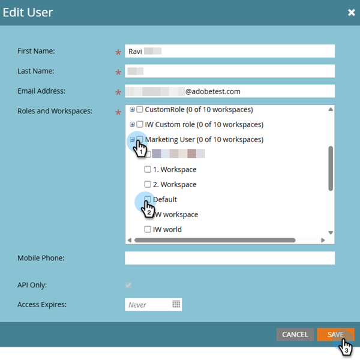
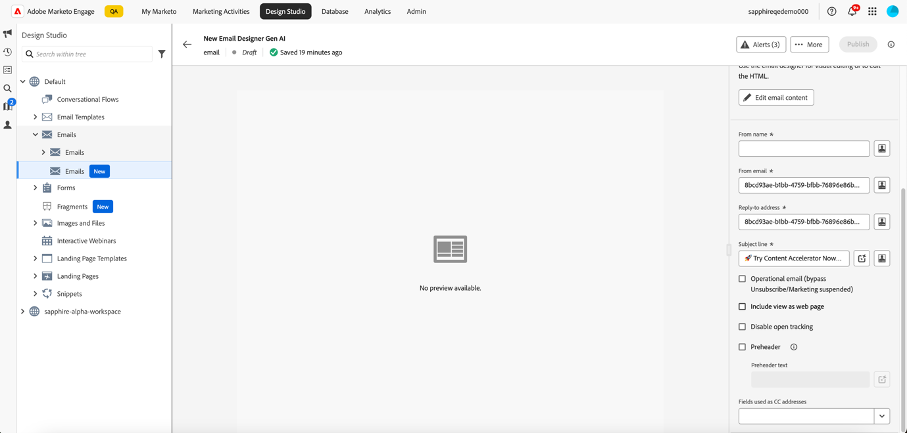
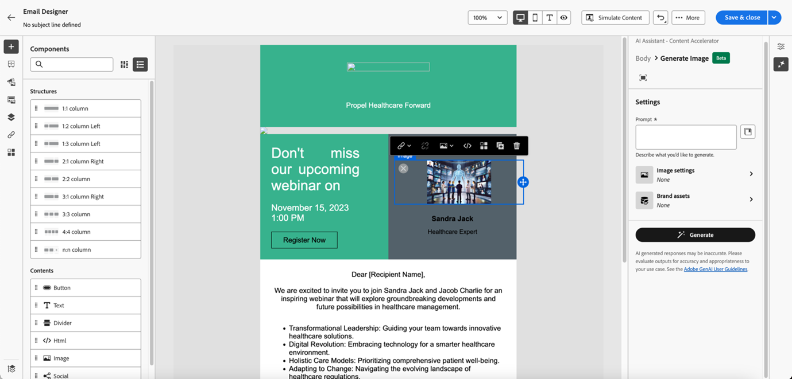

# 電子郵件Designer的AI助理 {#ai-assistant-email-designer}

Marketo Engage Email Designer中的AI Assistant可幫助您建立當代、高效能且直覺式的電子郵件。 透過 Adobe 的生成式 AI 技術和提示資料庫，並搭配 Firefly 來產生影像，協助針對特定的人物誌/購買群組、行銷歷程階段、溝通策略、語調等建立適當的內容，便能打造出這樣的電子郵件。也可以使用特定品牌資產來建立內容。

>[!PREREQUISITES]
>
>AI助理預設為未啟用。 您必須先同意[核心Gen-AI條款與補充條款](https://www.adobe.com/legal/terms/enterprise-licensing/genai-ww.html){target="_blank"}，才能在電子郵件Designer中使用Gen-AI功能。 如需詳細資訊，請聯絡Adobe客戶團隊（您的客戶經理）。

## 設定權限 {#set-up-permissions}

_依照上述必要條件，_&#x200B;之後，Marketo管理員必須先套用存取權給特定使用者/角色，使用者才能看到GenAI按鈕。

+++瞭解如何設定許可權

1. 在Marketo Engage中，按一下&#x200B;**管理員**&#x200B;並選取&#x200B;**使用者和角色**。

   

1. 在&#x200B;**角色**&#x200B;標籤中，按兩下所需的角色。

   

1. 在&#x200B;_Access Design Studio_&#x200B;下，選取&#x200B;**Access AI小幫手**&#x200B;核取方塊，然後按一下&#x200B;**儲存**。

   

1. 按一下使用者索引標籤，然後選取您要提供存取權的使用者。

   

1. 選取您在步驟3中選擇的角色以及所需的工作區（如果適用）。 按一下&#x200B;**儲存**。

   

+++

## 使用案例 {#use-cases}

AI Assistant有幾個主要使用案例：

* [為您的電子郵件建立主旨列和/或前置標題](#create-a-subject-line-preheader)
* [為電子郵件的特定區段](#create-content-for-a-specific-section)建立內容
* [從選取的範本建立整封電子郵件](#create-an-entire-email)

## 建立主旨行/預告標題 {#create-a-subject-line-preheader}

您可以使用AI助理建立主旨列、預覽文字或兩者。

以下範例說明主旨列。 若是預覽標題，按一下&#x200B;_預覽標題_&#x200B;核取方塊（如上圖所示）即可執行相同的步驟。

使用新電子郵件Designer建立電子郵件時，輸入暫時性主旨列。

建立電子郵件之後，主旨列在右側的&#x200B;_詳細資料_&#x200B;欄中。 按一下旁邊的AI助理按鈕（  ）以取得協助，使用Gen AI功能建立新的主旨列。

啟用AI助理的&#x200B;**使用參考內容**&#x200B;選項，以根據選取的內容個人化新內容。

輸入提示來自訂主旨列。 輸入相關文字設定，然後上傳您要用來作為參照的任何品牌資產，以建立適當的主旨行。

文字設定包括：

<table><tbody>
  <tr>
    <td style="width:25%"><b>購買群組</b></td>
    <td>您鎖定目標的特定購買群組（例如，從業人員、影響者、決策者）。</td>
  </tr>
  <tr>
    <td style="width:25%"><b>行銷歷程階段</b></td>
    <td>特定行銷歷程階段的收件者（例如，探索、評估、認可）。</td>
  </tr>
  <tr>
    <td style="width:25%"><b>溝通策略</b></td>
    <td>通訊的目標（例如，緊急、社交證明、資訊）。</td>
  </tr>
  <tr>
    <td style="width:25%"><b>語言</b></td>
    <td>您要產生主旨行的語言。</td>
  </tr>
  <tr>
    <td style="width:25%"><b>色調</b></td>
    <td>您希望產生內容的語調（例如，勵志、興奮、幽默）。</td>
  </tr>
  <tr>
    <td style="width:25%"><b>表情符號</b></td>
    <td>允許在產生的內容中包含表情符號。</td>
  </tr>
</tbody>
</table>

按一下&#x200B;**產生**&#x200B;後，會出現範例供您選擇：

您也可以上傳品牌資產，以使用資產內的內容作為建立主旨行的參考。

若要選擇變數，請選取其核取方塊，然後按一下&#x200B;**選取**。 您也可以按一下「調整&#x200B;****」來調整它。 此外，您可以按一下向上或向下縮圖示提供意見回饋，讓Gen-AI技術學習您的偏好設定。

做出選擇後，主旨列會填入您的電子郵件詳細資訊中。

## 為您的電子郵件特定區段建立內容 {#create-content-for-a-specific-section}

建立電子郵件後，您可以選擇修改某些區段、影像或文字。

在此範例中，我們使用財務範本。 如果一或多個現有影像不符合您的需求，您可以指示AI助理根據您的說明建立新影像。 選取所需的影像，然後按一下AI助理圖示。

在提示中輸入相關細節，例如「銀行家，拿著成棧的現金，坐在辦公桌旁」。 如果您不確定要輸入什麼，也可以使用提示程式庫（在提示的右側）。 按一下&#x200B;**影像設定**。

按一下切換即可啟用&#x200B;_使用AI產生影像_，然後變更任何需要的設定，包括要使用的模型（Adobe Firefly或Gemini 2.5 Nano Banana）。 完成時，按一下&#x200B;**產生**。

已建立多個變體。 選擇您的最愛，然後按一下&#x200B;**套用**。

>[!NOTE]
>
>如果沒有任何影像符合您的需求，請再按一下[產生] **來建立新版本。**

與影像類似，也可以修改電子郵件的文字部分。

## 從選取的範本建立整個電子郵件 {#create-an-entire-email}

僅當使用現有範本建立電子郵件時，才可使用此選項。 可以是電子郵件Designer提供的標準範本、您已建立的已儲存範本，或使用「匯入HTML」選項匯入的範本。 如果您為電子郵件選擇[從草稿開始設計](/help/marketo/product-docs/email-marketing/email-designer/email-authoring.md#design-from-scratch)，則無法使用此選項。

選取範本，不選取範本中的任何元件，然後按一下「電子郵件Designer」中的AI助理按鈕。

輸入相關提示，然後選擇文字設定、品牌資產，以及您想要用於電子郵件的任何影像設定。

如果您想要使用Firefly產生影像，請選取「影像設定」並選取&#x200B;**使用AI產生影像**&#x200B;的切換按鈕。

選取所需的&#x200B;_內容型別_、_色彩和色調_、_光源_&#x200B;和&#x200B;_構成_，為您的電子郵件建立Gen-AI影像。 完成時，按一下&#x200B;**產生**。

按一下&#x200B;**預覽**，檢視變數在電子郵件中的外觀。 按一下&#x200B;**套用**&#x200B;以選擇變數。
