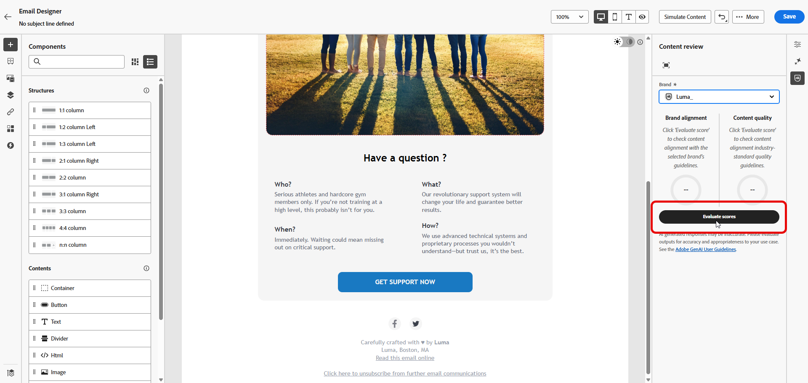
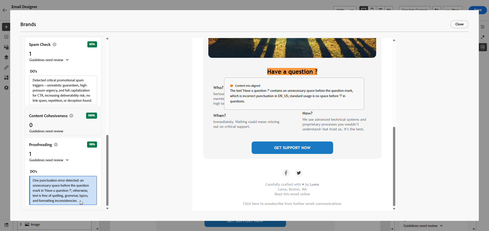

# 品牌分數 {#brand-score}

檢閱您的品牌分數可確保您的電子郵件行銷活動的語調、訊息和視覺身分的一致性，並作為內容上線之前的品質檢查。

>[!AVAILABILITY]
>
>您必須同意[使用者合約](https://www.adobe.com/tw/legal/licenses-terms/adobe-dx-gen-ai-user-guidelines.html){target="_blank"}{target="_blank"}，才能在Adobe Marketo Engage中使用AI小幫手。 如需詳細資訊，請聯絡您的 Adobe 代表。

## 透過品牌一致性驗證您的內容 {#validate-content}

您的品牌在[設定並發佈](/help/marketo/product-docs/email-marketing/email-designer/brands/manage-brands.md#create-brand-kit){target="_blank"}後，請直接在電子郵件行銷活動中評估您的品牌一致性分數，以確保您的內容符合您的品牌准則。

1. 在您的電子郵件中，按一下&#x200B;**[!UICONTROL Brand Alignment]**&#x200B;圖示。

   您的內容會自動評估您的[預設品牌](/help/marketo/product-docs/email-marketing/email-designer/brands/manage-brands.md#default-brand){target="_blank"}。

   {width="800" zoomable="yes"}

1. 若要使用其他品牌進行評估，請從&#x200B;**[!UICONTROL Brand]**&#x200B;下拉式功能表中選取該品牌，然後按一下&#x200B;**[!UICONTROL Evaluate score]**。

   {width="800" zoomable="yes"}

1. 瀏覽&#x200B;**[!UICONTROL Writing style]**&#x200B;或&#x200B;**[!UICONTROL Visual content]**，檢視更多有關您評分的深入分析。

   {width="800" zoomable="yes"}

1. 按一下圖示，以取得您品質分數的詳細檢視。

   {width="800" zoomable="yes"}

1. 選取任何已標幟的指引以檢視特定意見和建議。 品牌一致性會評估以下類別：

   * **[!UICONTROL Writing style]**:
      * **[!UICONTROL Brand communication style]**：定義個性與情緒基調，以確保所有管道的品牌語調一致。
      * **[!UICONTROL Brand messaging standards]**：有效行銷和促銷文字的結構化和格式化規則。
      * **[!UICONTROL Legal compliance standards]**：確保所有通訊符合法律要求，包括文字放置和法規遵循檢查清單。

   * **[!UICONTROL Visual content]**:
      * **[!UICONTROL Photography standards]**：像片內容的需求，包括解析度、構成、光線和檔案格式。
      * **[!UICONTROL Illustration standards]**：插圖的樣式引數、線條寬度、色彩使用方式及檔案格式需求。
      * **[!UICONTROL Icon standards]**：圖示設計的規格，包括格線系統、線條粗細，以及調整大小以保持一致性。
      * **[!UICONTROL Usage guidelines]**：影像選擇、放置和內容的最佳實務，以維護品牌識別。

   {width="800" zoomable="yes"}

1. 根據建議編輯您的內容，以改善品牌一致性。

1. 進行變更後手動重新評估內容，以重新整理對齊分數。

## 驗證您的內容品質 {#validate-quality}

>[!NOTE]
>
>內容品質評估不受品牌指引影響。 即使在下拉式選單中選取了品牌，其准則也不會套用至品質檢查。 品牌選擇僅與品牌一致性評分相關。

除了品牌一致性之外，您還可以評估一般內容品質，以找出可讀性、內容一致性和有效性方面的潛在問題，不受品牌指南影響。

若要評估您的內容品質：

1. 在您的電子郵件中，按一下&#x200B;**[!UICONTROL Brand Alignment]**&#x200B;圖示。

   {width="800" zoomable="yes"}

1. 按一下「**[!UICONTROL Evaluate score]**」以產生品牌一致性和內容品質分數。

   {width="800" zoomable="yes"}

1. 導覽至「**[!UICONTROL Overall quality]**」標籤，檢閱您的內容品質深入分析和建議。

   {width="800" zoomable="yes"}

1. 按一下圖示，以取得您品質分數的詳細檢視。

   {width="800" zoomable="yes"}

1. 選取任何已標幟的專案，以檢視特定意見和可操作的改進建議。 分數以下列類別為基礎：

   * **[!UICONTROL CTA effectiveness]**：評估您的call-to-action激勵讀者採取所需動作的程度。
   * **[!UICONTROL Subject Line]**：評估清晰度、相關性和吸引注意力的品質，以鼓勵電子郵件開啟。
   * **[!UICONTROL Readability]**：測量您的內容對於讀者來說有多容易理解和吸引人。
   * **[!UICONTROL Spam Check]**：識別可能影響傳遞能力的常見垃圾郵件觸發程式。
   * **[!UICONTROL Content Cohesiveness]**：確保您的內容流程順暢並停留在主題上。
   * **[!UICONTROL Proofreading]**：檢查拼字、語法和清晰度問題。

   {width="800" zoomable="yes"}

1. 根據建議編輯您的內容，以增強可讀性、內容凝聚度和整體品質。

1. 進行變更後按一下&#x200B;**[!UICONTROL Re-evaluate score]**&#x200B;以重新整理您的品質分數。
