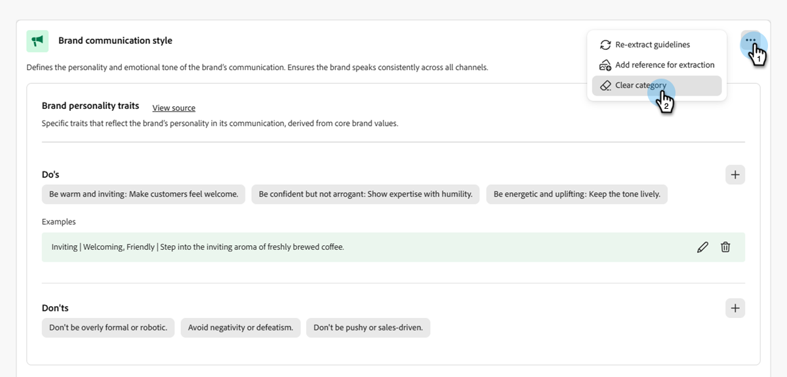

# 建立並管理您的品牌 {#create-and-manage-brands}

品牌指引是一組詳細的規則和標準，可建立品牌的視覺和口頭識別。 這些可作為參考，以在所有行銷和通訊平台上維持一致的品牌代表性。

手動輸入及組織您的品牌詳細資料，或上傳品牌指引檔案，以便自動擷取資訊。

>[!AVAILABILITY]
>
>您必須同意[使用者合約](https://www.adobe.com/tw/legal/licenses-terms/adobe-dx-gen-ai-user-guidelines.html){target="_blank"}，才能在Adobe Marketo Engage中使用AI小幫手。 如需詳細資訊，請聯絡您的Adobe客戶經理。

## 存取品牌 {#access}

若要在&#x200B;**[!UICONTROL brands]**&#x200B;中存取[!DNL Adobe Marketo Engage]功能表，使用者必須獲得相關許可權。

+++  瞭解如何指派品牌相關許可權

### 使用者和角色 {#users-and-roles}

1. 在&#x200B;_管理員_&#x200B;中，選取&#x200B;**使用者與角色**。

1. 選取所需的角色。

1. 按一下以展開&#x200B;**Access Design Studio**&#x200B;功能表。

1. 選取&#x200B;**存取AI小幫手**&#x200B;並按一下&#x200B;**儲存**。

+++

## 建立及管理您的品牌 {#create-brand-kit}

若要建立和管理您的品牌指引，您可以自行輸入詳細資料，或上傳品牌指引檔案以自動擷取資訊。

1. 在&#x200B;_管理員_&#x200B;中，選取&#x200B;**新增體驗**。

   

1. 在&#x200B;_管理您的品牌_&#x200B;旁邊，按一下&#x200B;**編輯**。

   

1. 按一下「**[!UICONTROL Create brand]**」。

1. 為您的品牌輸入&#x200B;**[!UICONTROL Name]**。

1. 拖放或選取PDF以上傳品牌指引，並自動擷取相關的品牌資訊。 按一下「**[!UICONTROL Create]**」。

   資訊擷取程式隨即開始。 這可能需要幾分鐘才能完成。

   

1. 系統現在會自動填入您的內容和視覺化建立標準。 瀏覽不同的標籤，視需要調整資訊。

1. 從每個區段或類別的進階功能表中，您可以新增參照以自動擷取相關品牌資訊。

   若要移除現有內容，請使用&#x200B;**[!UICONTROL Clear section]**&#x200B;或&#x200B;**[!UICONTROL Clear category]**&#x200B;選項。

   {width="800" zoomable="yes"}

   {width="800" zoomable="yes"}

1. 按一下&#x200B;**篩選器**，依管道或元素型別篩選准則。

   

1. 完成設定後，按一下&#x200B;**[!UICONTROL Save]**，然後按&#x200B;**[!UICONTROL Publish]**，讓您的品牌指引可在AI助理中取得。

1. 若要修改您發佈的品牌，請按一下&#x200B;**[!UICONTROL Edit brand]**。

   >[!NOTE]
   >
   >這會在編輯模式中建立暫時副本，在發佈即時版本後取代即時版本。

   

1. 在&#x200B;**[!UICONTROL Brands]**&#x200B;儀表板中，按一下三個點的圖示來開啟進階功能表：

* 檢視品牌
* 編輯
* 重複
* 發佈
* 取消發佈
* 刪除

  

您現在可以從AI Assistant功能表的&#x200B;**[!UICONTROL Brand]**&#x200B;下拉式清單存取品牌指南，使其產生符合您規格的內容和資產。

### 設定預設品牌 {#default-brand}

您可以將已發佈的品牌指定為預設值，以便在建立促銷活動期間產生內容及計算一致性分數時自動套用。

若要設定預設品牌，請移至您的&#x200B;**[!UICONTROL Brands]**&#x200B;儀表板。 按一下三點圖示並選取&#x200B;**[!UICONTROL Mark as default brand]**，開啟進階功能表。

