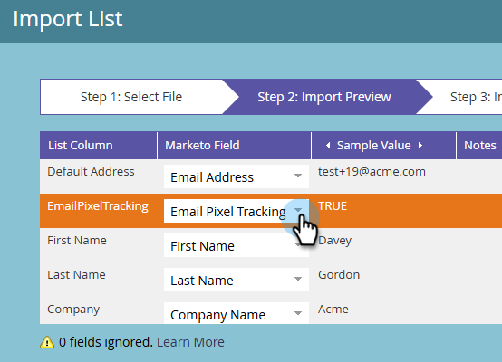

# CNIL指引合規性：條件式電子郵件開啟追蹤 {#cnil}

瞭解如何根據CNIL准則（社群連結），設定Marketo Engage以遵循電子郵件開啟（畫素）追蹤的一般使用者同意。 方法使用自訂布林值欄位來判斷某人收到哪個電子郵件變體，一個啟用開啟追蹤，另一個停用開啟追蹤。

## 步驟1：建立自訂布林值欄位 {#custom-field}

1. 在&#x200B;**管理員**&#x200B;區域中，按一下&#x200B;**欄位管理**&#x200B;並選取&#x200B;**新增自訂欄位**。

   

1. 針對&#x200B;_物件_，請選擇&#x200B;**人員**。 針對&#x200B;_型別_，請選擇&#x200B;**布林值**。 針對&#x200B;_名稱_，輸入「電子郵件畫素追蹤」（API名稱會自動填入）。 按一下&#x200B;**建立**。

   

## 步驟2：填入同意欄位 {#populate}

1. 透過資料匯入（API同步或[CSV上傳](https://experienceleague.adobe.com/en/docs/marketo/using/getting-started/quick-wins/import-a-list-of-people){target="_blank"}）設定每個人的電子郵件畫素追蹤欄位值。

   

1. 確保自訂欄位已正確對應。

   

>[!NOTE]
>
>日後，您可以在表單填寫期間直接擷取資料，讓人員選擇加入或退出電子郵件開啟追蹤。

## 步驟3：建立電子郵件變體 {#variants}

建立兩封電子郵件。 請注意，電子郵件Designer和舊版電子郵件編輯器預設都會啟用電子郵件開啟追蹤。

* **Email One （啟用開啟追蹤）**：建立電子郵件後，不需要進一步的動作。 保持開啟追蹤已啟用。

* **電子郵件二（開啟追蹤已停用）**：複製電子郵件一併停用開啟追蹤。

  

在電子郵件Designer中，您可在電子郵件右側&#x200B;_摘要_&#x200B;窗格的&#x200B;_詳細資料_&#x200B;索引標籤中找到&#x200B;**停用開啟追蹤**&#x200B;核取方塊。 在舊版電子郵件編輯器中，_電子郵件設定_&#x200B;功能表中會顯示&#x200B;**停用開啟追蹤**&#x200B;核取方塊。

**電子郵件設計工具**

{width="800" zoomable="yes"}

**舊版電子郵件編輯器**

{width="800" zoomable="yes"}

## 步驟4：設定Smart Campaign {#smart-campaign}

[建立Smart Campaign](https://experienceleague.adobe.com/en/docs/marketo/using/product-docs/core-marketo-concepts/smart-campaigns/creating-a-smart-campaign/create-a-new-smart-campaign){target="_blank"}，以決定每個人收到的電子郵件。

1. 在Smart Campaign的&#x200B;_流量_&#x200B;索引標籤中，插入&#x200B;**傳送電子郵件**&#x200B;流量步驟。

   {width="800" zoomable="yes"}

1. 在流程步驟中，按一下&#x200B;**新增選擇**。 在Choice 1中，將&#x200B;**if**&#x200B;設為&#x200B;_電子郵件畫素追蹤_，將運運算元設為&#x200B;_is_，並將值設為&#x200B;_false_。 針對&#x200B;**電子郵件**，選取&#x200B;_電子郵件二_。

1. 在預設選擇中，將&#x200B;**電子郵件**&#x200B;設定為&#x200B;_電子郵件One_。

   

這可確保未同意開啟追蹤的人員會收到未追蹤的電子郵件，而同意的人員會收到標準追蹤的電子郵件。
