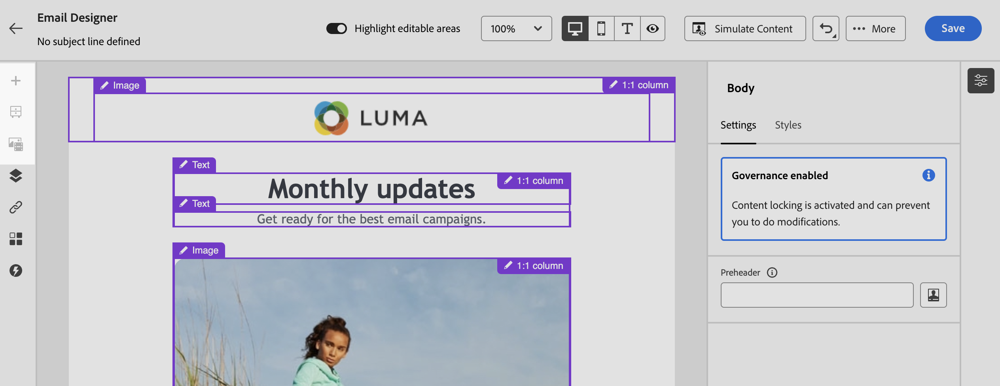

# 鎖定電子郵件範本中的內容 {#lock-content-email-templates}

Marketo Engage可讓您透過鎖定整個範本或特定結構/元件來鎖定電子郵件範本中的內容。 這樣做讓您可以防止無意間不小心編輯或刪除內容，讓您更能掌控範本自訂，進而提高電子郵件行銷活動的效率和可靠性。

>[!AVAILABILITY]
>
>擁有建立內容範本許可權的使用者可以啟用內容鎖定。

可在&#x200B;**結構**&#x200B;層級或&#x200B;**元件**&#x200B;層級套用內容鎖定。

* 鎖定結構時：

   * 該結構內的所有內容也會被鎖定。
   * 無法新增任何內容至結構。
   * 依預設，您無法刪除結構。 您可以啟用「允許刪除」選項來覆寫此限制。
   * 可將鎖定結構內的個別內容元件設定為可編輯。

* 當結構可編輯（結構未鎖定）時：

   * 個別內容元件可鎖定在該結構內。
   * 依預設，如果元件已鎖定，或選取「僅可編輯的內容鎖定」，則無法刪除元件。 您可以啟用「允許刪除」選項來覆寫此限制。

## 鎖定電子郵件範本 {#lock-an-email-template}

### 啟用內容鎖定 {#enable-content-locking}

無論您是要建立新範本或編輯現有範本，都可直接在電子郵件Designer中啟用電子郵件範本的內容鎖定。

1. 開啟或建立電子郵件範本，並存取電子郵件Designer中的內容編輯畫面。

1. 在右側的&#x200B;**[!UICONTROL 內文]**&#x200B;窗格中，啟用&#x200B;**[!UICONTROL 治理]**&#x200B;選項。

1. 從&#x200B;**[!UICONTROL 模式]**&#x200B;下拉式清單中，選取範本所需的鎖定模式：

   * **[!UICONTROL 內容鎖定]**：鎖定範本中內容的特定區段。 依預設，所有結構和元件都可編輯。 然後，您可以選擇鎖定個別元素。
   * **[!UICONTROL 唯讀]**：鎖定範本的整個內容，防止任何修改。

   {width="800" zoomable="yes"}

1. 如果您選取&#x200B;**[!UICONTROL 內容鎖定]**&#x200B;模式，您可以進一步定義使用者如何與範本互動。 啟用&#x200B;**[!UICONTROL 啟用內容版本]**&#x200B;選項，並選擇下列其中一項：

   * **[!UICONTROL 允許結構和內容新增]**：使用者可以在現有結構之間新增結構，並在可編輯的結構中新增內容元件或片段。

   * **[!UICONTROL 僅允許新增內容]**：使用者可以在可編輯的結構中新增內容元件或片段，但無法新增或重複結構。

1. 選取鎖定模式後，您可以定義若選取&#x200B;**[!UICONTROL 內容鎖定]**&#x200B;模式，要鎖定的結構和/或元件：

   * [瞭解如何鎖定結構](#lock-structures)
   * [瞭解如何鎖定元件](#lock-components)

   如果您選擇&#x200B;**[!UICONTROL 唯讀]**&#x200B;模式，您可以繼續完成並儲存範本。

您可以在設計範本時，透過選取範本主體隨時調整&#x200B;**[!UICONTROL 治理]**&#x200B;設定。 若要這麼做，請按一下右側窗格頂端導覽邊欄中的&#x200B;**[!UICONTROL 內文]**&#x200B;連結。

{width="800" zoomable="yes"}

### 鎖定結構 {#lock-structures}

若要鎖定範本中的結構：

1. 選取要鎖定的結構。

1. 在&#x200B;**[!UICONTROL 鎖定型別]**&#x200B;下拉式清單中，選擇&#x200B;**[!UICONTROL 鎖定]**。

   {width="800" zoomable="yes"}

   >[!NOTE]
   >
   >依預設，使用者無法刪除已鎖定的結構。您可以透過啟用「**[!UICONTROL 允許刪除]**」選項來覆寫此限制。

鎖定結構後，無法複製或新增其他內容元件或片段。 依照預設，鎖定結構內的所有元件也會鎖定。 若要讓元件在鎖定的結構中可編輯：

1. 選取您要解除鎖定的元件。

1. 啟用&#x200B;**[!UICONTROL 使用特定鎖定]**&#x200B;選項。

1. 在&#x200B;**[!UICONTROL 鎖定型別]**&#x200B;下拉式清單中，選擇&#x200B;**[!UICONTROL 可編輯]**。 若要在鎖定樣式時允許編輯內容，請選取&#x200B;**[!UICONTROL 僅可編輯的內容]**。 [瞭解如何鎖定元件](#lock-components)

   {width="800" zoomable="yes"}

### 鎖定元件 {#lock-components}

若要鎖定結構內的特定元件：

1. 選取元件並啟用右窗格中的&#x200B;**[!UICONTROL 使用特定鎖定]**&#x200B;選項。

1. 從&#x200B;**[!UICONTROL 鎖定型別]**&#x200B;下拉式清單中，選取您偏好的鎖定選項：

   {width="800" zoomable="yes"}

   * **[!UICONTROL 僅可編輯的內容鎖定]**：鎖定元件的樣式，但允許編輯內容。
   * **[!UICONTROL 已鎖定]**：已完全鎖定元件的內容和樣式。

   >[!NOTE]
   >
   >**[!UICONTROL 可編輯的]**&#x200B;鎖定型別可讓使用者編輯元件，即使是在鎖定的結構內。 [瞭解如何鎖定結構](#lock-structures)

1. 依預設，使用者無法刪除鎖定的元件。 您可以啟用&#x200B;**[!UICONTROL 允許刪除]**&#x200B;選項來啟用刪除。

### 識別鎖定的內容 {#identify-locked-content}

若要輕鬆識別範本中鎖定的結構和元件，請使用左側功能表中的&#x200B;**[!UICONTROL 導覽樹狀結構]**。 此選單提供所有範本元素的視覺化概觀，以鎖定圖示醒目提示鎖定的專案，並以鉛筆圖示醒目提示可編輯的專案。

在下列範例中，已針對範本本文啟用治理。 *結構2*&#x200B;已鎖定，*元件1*&#x200B;可編輯，而&#x200B;*結構3*&#x200B;已完全鎖定。

{width="800" zoomable="yes"}

## 使用具鎖定內容的範本 {#use-templates-with-locked-content}

使用包含鎖定內容的範本時，**[!UICONTROL 啟用治理]**&#x200B;訊息會顯示在右窗格中。

根據套用於範本的鎖定類型，您可以在範本的結構和元件執行不同的動作。若要快速識別範本中的所有可編輯區域，請啟用&#x200B;**[!UICONTROL 反白可編輯區域]**&#x200B;選項。

例如，在下方的範本中，除了已鎖定的頂端影像之外，所有區域都是可編輯的，這表示您無法編輯或移除它。

{width="800" zoomable="yes"}

以下是一些電子郵件編輯的範例，以及已設定的相關內容鎖定設定：

<table>
<thead>
  <tr>
    <th>內容鎖定型別</th>
    <th>範本設定</th>
    <th>電子郵件版本</th>
  </tr></thead>
<tbody>
  <tr>
    <td>唯讀內容範本</td>
    <td></td>
    <td></td>
  </tr>
  <tr>
    <td>完整內容可編輯，但使用者無法新增任何結構或元件</td>
    <td></td>
    <td></td>
  </tr>
  <tr>
    <td>無法刪除的鎖定結構</td>
    <td></td>
    <td></td>
  </tr>
  <tr>
    <td>具有鎖定樣式且無法刪除的元件。 使用者只能修改內容。</td>
    <td></td>
    <td></td>
  </tr>
  <tr>
    <td>鎖定結構內的可編輯元件。</td>
    <td></td>
    <td></td>
  </tr>
</tbody>
</table>
