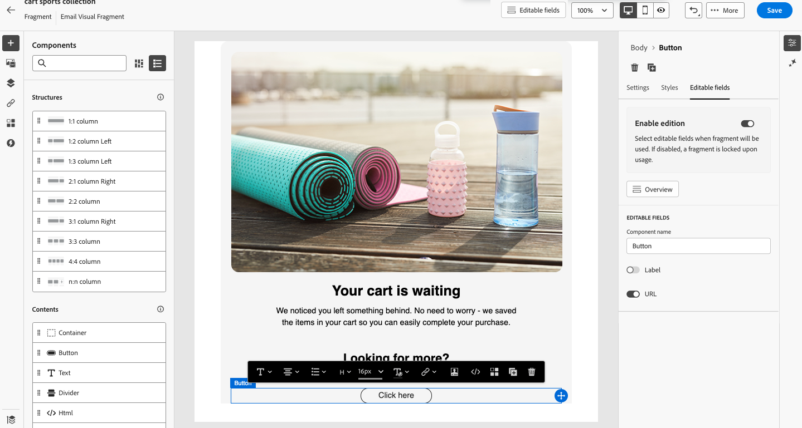

# 可自訂的片段 {#customizable-fragments}

在電子郵件或電子郵件範本中使用片段時，依預設會因繼承而鎖定。 這表示對片段所做的任何變更都會自動傳播至使用片段的所有資產。 有了可自訂的片段，當片段新增到電子郵件或電子郵件範本時，片段中的特定欄位可以定義為可編輯。 例如，假設您有一個片段包含橫幅、一些文字和按鈕。 您可以將某些欄位（例如影像或按鈕目標URL）指定為可編輯。 這可讓使用者在將片段整合至其電子郵件/電子郵件範本時修改這些元素，提供量身打造的體驗，而不會影響原始片段。

運用可自訂的片段，您可以有效地管理和個人化您的內容，而不需要建立全新的內容區塊或中斷原始片段的繼承。 這樣可確保在片段層級進行的變更仍會傳播，同時允許在電子郵件/電子郵件範本層級進行必要的自訂。

視覺效果和運算式片段都可以標示為可自訂。 有關如何繼續處理每種型別片段的詳細說明，請參閱以下章節。

## 在視覺片段中新增可編輯欄位 {#visual}

若要讓視覺化片段的某些部分可編輯，請遵循下列步驟：

>[!NOTE]
>
>可編輯的欄位可新增至&#x200B;**影像**、**文字**&#x200B;和&#x200B;**按鈕**&#x200B;元件。 針對&#x200B;**HTML**&#x200B;元件，使用個人化編輯器新增可編輯的欄位，類似於運算式片段。 [瞭解如何在HTML元件和運算式片段中新增可編輯的欄位](#expression)

1. 開啟片段內容版本畫面。

1. 選取片段中要設定可編輯欄位的元件。

1. 元件屬性窗格會在右側開啟。 選取「**[!UICONTROL Editable fields]**」標籤，然後切換「**[!UICONTROL Enable edition]**」選項。

1. 窗格中會列出所有可編輯所選元件的欄位。 可編輯的欄位取決於所選的元件型別。

   在以下範例中，我們允許編輯「按一下這裡」按鈕URL。

   {width="800" zoomable="yes"}

1. 按一下&#x200B;**[!UICONTROL Overview]**&#x200B;以檢查所有可編輯的欄位及其預設值。

   在此範例中，按鈕URL欄位會以元件中定義的預設值顯示。 使用者將片段新增至內容後，即可自訂此值。

   {width="800" zoomable="yes"}

1. 完成時儲存變更。

將片段新增到電子郵件後，使用者將能夠自訂片段中設定的所有可編輯欄位。
<!--
## Add editable fields in HTML components and expression fragments {#expression}

To make portions of an HTML component or an expression fragment editable, you must use a specific syntax in the expression editor. This involves declaring a _variable_ with a default value that users can override after adding the fragment to their content.

For example, suppose you want to create a fragment to add to your emails, and allow users to customize a specific color used in different locations, such as frames or buttons' background colors. When creating your fragment, you need to declare a variable with a _unique ID_ (e.g., "color"), and call it at the desired locations in the fragment content where you want to apply this color. When adding the fragment to their content, users will be able to customize the color used wherever the variable is referenced.

For HTML components, only specific elements can become editable fields. Expand the section below for more information.

+++Editable elements in HTML components:

The elements below can become editable fields in an HTML component:

* A portion of text
* A full URL for link or image (doesn't work with portion of a URL)
* Entire CSS property (doesn't work with partial property)

For example, in the code below, each element highlighted in red can become a property:

{width="500" zoomable="yes"}

+++
-->
>[!MORELIKETHIS]
>
>[片段](/help/marketo/product-docs/email-marketing/email-designer/fragments.md){target="_blank"}
