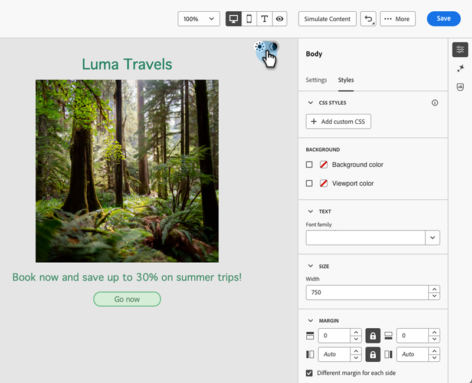

# 深色模式 {#dark-mode}

設計電子郵件時，電子郵件Designer可讓您切換至&#x200B;**[!UICONTROL Dark mode]**&#x200B;檢視。

在&#x200B;**[!UICONTROL Dark mode]**&#x200B;中，您可以定義當電子郵件使用者端開啟深色模式時，透過支援電子郵件使用者端所顯示的特定自訂設定。

## 什麼是深色模式？ {#what-is-dark-mode}

深色模式可支援電子郵件使用者端和應用程式針對文字、按鈕和其他UI元素，顯示背景較暗且顏色較淺的電子郵件。 它有助於減少眼睛疲勞、節省電池壽命，並改善低光環境的可讀性，提供更舒適的觀賞體驗。

## 護欄 {#guardrails}

深色模式呈現在不同電子郵件使用者端中可能會有很大的差異。

在使用深色模式之前，請務必瞭解主要電子郵件使用者端如何處理它。 區分的案例有三種：

### 使用者端不支援深色模式 {#not-supporting}

有些電子郵件使用者端完全不支援此功能，例如：

* Yahoo！Mail
* AOL

無論您是否定義深色模式自訂設定，這些電子郵件使用者端都不會顯示任何深色模式轉譯。

### 使用者端套用自己的深色模式 {#default-support}

有些電子郵件使用者端會系統地將其本身的預設深色模式套用至所收到的所有電子郵件。 顏色、背景、影像等會自動調整為該電子郵件使用者端專用的深色模式設定。 無法進行外部修改。

以下是一些範例：

* Gmail (案頭網頁郵件、iOS、Android、行動網頁郵件)
* Outlook Windows
* Outlook Windows Mail

在此案例中，如果您在電子郵件Designer中定義自訂深色模式設定，則這些設定會被電子郵件使用者端的設定覆寫。

因此，雖然這些電子郵件使用者端確實會處理深色模式，但您的特定深色模式設計將不會呈現。

### 支援自訂深色模式的使用者端 {#custom-dark-mode}

某些電子郵件使用者端提供以`@media (prefers-color-scheme: dark)`查詢呈現自訂深色模式的選項，這是[!DNL Marketo Engage]電子郵件Designer所使用的方法。

處理此選項的主要使用者端有：

* Apple Mail macOS
* Apple Mail iOS
* Outlook macOS
* Outlook.com
* Outlook iOS
* Outlook Android

此時應會顯示您在電子郵件Designer中定義的設定。

>[!NOTE]
>
>瞭解如何在電子郵件Designer中定義[自訂深色模式設定](#define-custom-dark-mode)。

每個電子郵件使用者端可能會有不同的限制。 例如，如果影像存在，部分使用者端(例如Apple Mail 16)將不會產生深色模式。

為了獲得最佳結果，請在您定位的電子郵件使用者端中測試您的內容。 若要檢視每個使用者端中的模擬，請使用電子郵件Designer中的[電子郵件呈現](/help/marketo/product-docs/email-marketing/email-designer/test-email-rendering.md)功能。

## 電子郵件設計工具中的深色模式 {#dark-mode-email-designer}

在電子郵件Designer中，若要使用深色模式，必須考量兩個方面：

* 您可以預覽預設深色模式在大多數支援的電子郵件使用者端中的呈現方式。 [了解更多](#preview-dark-mode)

* 如果您想要覆寫支援電子郵件使用者端的預設設定，可以在正在編輯的電子郵件中定義自訂深色模式設定。 [了解更多](#define-custom-dark-mode)

### 預覽預設深色模式 {#preview-dark-mode}

瞭解如何在電子郵件Designer中存取深色模式，並取得預設深色模式設定的預覽。

1. 從電子郵件Designer首頁，選取&#x200B;**[!UICONTROL Design from scratch]**&#x200B;選項。

1. 將[結構和內容](/help/marketo/product-docs/email-marketing/email-designer/email-authoring.md#add-structure-and-content)新增至您的電子郵件。

1. 在右上方，啟用&#x200B;**[!UICONTROL Dark mode]**&#x200B;切換按鈕。

   

1. 預設深色模式預覽隨即顯示。

   

依預設，電子郵件Designer深色模式預覽會將「全色反轉」色彩配置套用至影像和圖示以外的所有元素。

也就是說，它會偵測含有明暗元素的區域，並加以反轉，讓淺色背景變成深色，深色文字變成淺色，而深色背景變成淺色，淺色文字變成深色。

>[!CAUTION]
>
>最終呈現內容可能會因收件者的電子郵件使用者端而異。 若要檢視每個電子郵件使用者端的模擬，請使用[電子郵件呈現](/help/marketo/product-docs/email-marketing/email-designer/test-email-rendering.md)功能。

### 定義自訂深色模式 {#define-custom-dark-mode}

切換至&#x200B;**[!UICONTROL Dark mode]**&#x200B;後，您可以選擇編輯內容的特定樣式元素，這些樣式元素只有在收件者的電子郵件使用者端中啟用深色模式時才會顯示（前提是它支援該功能）。

>[!IMPORTANT]
>
>深色模式的最終呈現取決於每個電子郵件使用者端，因此結果可能會因使用者端而異。 [了解更多](#guardrails)

若要運用Email Designer自訂深色模式樣式，Marketo Engage會使用`@media (prefers-color-scheme: dark)` CSS查詢，以偵測使用者的電子郵件使用者端是否已設為深色模式，並套用您電子郵件中定義的深色主題設計。

若要定義自訂深色模式設定，請遵循下列步驟。

1. 在電子郵件Designer中切換至[深色模式預覽](#preview-dark-mode)。

1. 編輯任何樣式色彩屬性，例如文字、背景、按鈕等。

1. 您無法變更影像和圖示的顏色，但只能為深色模式定義特定資產。 若要這麼做，請選取任何影像。 使用&#x200B;**[!UICONTROL Dark mode]**&#x200B;窗格中的專用切換開關切換至&#x200B;**[!UICONTROL Settings]**，並選取其他資產。

   

1. 您隨時可以&#x200B;**[!UICONTROL Switch to live view]**，以檢視您的內容在各種裝置大小上的呈現方式。 從此檢視中，選取「深色模式」切換按鈕，即可預覽不同裝置上深色模式內容的版本。

   

   >[!NOTE]
   >
   >即時檢視是通用的預覽，用來比較各種裝置大小下的轉譯效果。 最終呈現內容可能會因收件者的電子郵件使用者端而異。

1. 在您滿意深色模式的變更後，請按一下&#x200B;**[!UICONTROL Simulate Content]**。

   

1. 選取&#x200B;**[!UICONTROL Render email]**&#x200B;並連線至您的Litmus帳戶。 您可以看到各種電子郵件使用者端的最終深色模式演算。 深入瞭解[電子郵件呈現](/help/marketo/product-docs/email-marketing/email-designer/test-email-rendering.md)。

   >[!IMPORTANT]
   >
   >雖然模擬非常接近電子郵件在深色模式下的顯示方式，但由於電子郵件服務提供者或裝置設定的差異，實際呈現可能會有所不同。

## 最佳做法 {#best-practices}

隨著主要電子郵件使用者端採用深色模式的人數增加，無論您是否使用[自訂深色模式](#define-custom-dark-mode)，都必須考慮您的電子郵件在明暗環境中的呈現方式。

深色模式可以改變顏色、背景和影像 — 有時會覆寫設計選擇。 為確保視覺一致性、協助工具及品牌完整性，請遵循下列最佳實務。

**最佳化您的影像和標誌**

* 將圖志和圖示儲存為具有透明背景的PNG，以避免在深色模式中看到白色方塊。

* 避免使用硬式編碼白色或淺色背景的影像。

* 如果無法使用透明度，請在設計中將影像置於純色背景上，以防止發生尷尬的顏色倒轉。

**觀看您的背景**

* 確保文字和背景顏色之間有足夠的對比，以便在淺色和深色模式中都能閱讀。

* 避免僅依賴背景顏色處理重要內容。 有些使用者端會以深色模式覆寫背景顏色，因此請確定關鍵資訊仍然可見。

**在深色模式中設計可存取的內容**

* 使用顏色組合，可輕鬆區別色盲人士。

* 使用中間調調色盤，確保與淺色和深色背景的對比。

* 使用具有高對比度的無障礙色彩組合，以改善可讀性，並符合網頁內容可及性指引(WCAG)標準。 使用WebAIM的「對比檢查器」等工具，驗證色彩對比。

* 避免使用精簡字型，因為這會影響可讀性。 如果您的品牌需要細字型，請在深色模式中將其粗體。

* 略過純黑色的純白色，因為它可能會導致眼睛疲勞，並且可能會由某些電子郵件使用者端自動反轉。

* 如果深色模式不受支援，請提供可存取的遞補樣式。

**在深色模式環境中測試您的電子郵件**

* 使用電子郵件Designer的[深色模式預覽](#preview-dark-mode)，它使用反轉的色彩配置來提早發現問題。

* 使用[電子郵件呈現](/help/marketo/product-docs/email-marketing/email-designer/test-email-rendering.md)功能，此功能可利用Litmus模擬您跨主要電子郵件使用者端的設計，並瞭解色彩和影像在深色模式下的行為。
