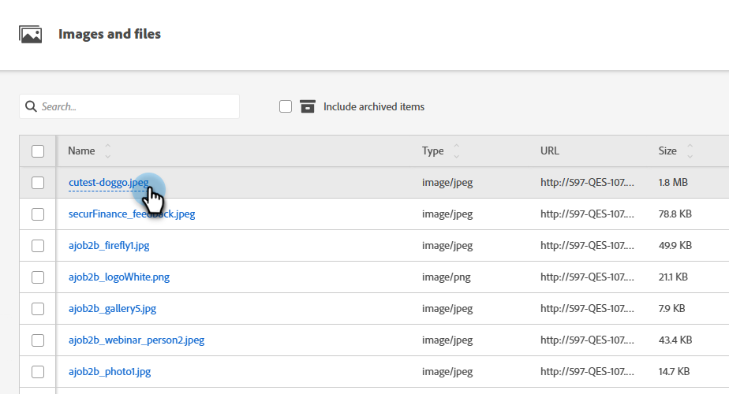
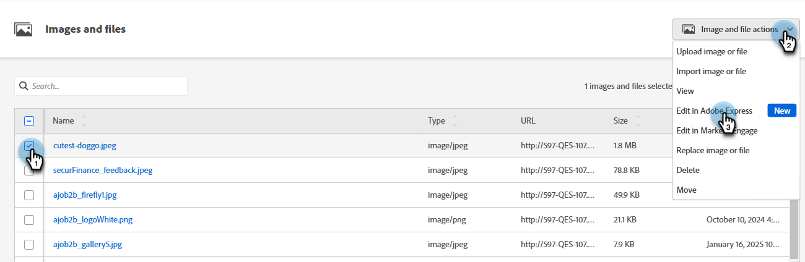

# 使用 Adobe Express 編輯影像 {#edit-images-with-adobe-express}

Adobe Marketo Engage與Adobe Express原生整合，可讓您存取多種影像編輯工具。 您可以使用這些工具在Marketo Engage Design Studio中修改影像。 整合提供下列主要優點：

* 透過在Marketo Engage中編輯和儲存新影像，增加內容重複使用率。

* 減少更新影像或建立現有影像新版本的時間和精力。

>[!NOTE]
>
>Adobe Express目前僅支援PNG和JPEG影像檔案格式。

## 存取Adobe Express編輯器 {#access-the-adobe-express-editor}

存取Adobe Express編輯器有兩個方法：

* 按一下影像名稱
* _影像和檔案動作_&#x200B;下拉式功能表

>[!BEGINTABS]

>[!TAB 按一下影像名稱]

1. 在Marketo Engage中，移至&#x200B;**[!UICONTROL Design Studio]**&#x200B;並選取&#x200B;**[!UICONTROL 影像和檔案]**。

   {width="600" zoomable="yes"}

1. 選取您要編輯的影像。

   {width="600" zoomable="yes"}

   >[!NOTE]
   >
   >* 若要依工作區和資料夾檢視資產，請按一下左上方的&#x200B;**[!UICONTROL 顯示資料夾]**&#x200B;圖示以開啟結構。
   >
   >* 若要依任何欄排序表格，請按一下欄標題。 標題列中的箭頭表示目前的排序欄和順序。

1. 在影像&#x200B;_詳細資料_&#x200B;索引標籤中，按一下&#x200B;**[!UICONTROL 在Adobe Express中編輯]**。

   {width="600" zoomable="yes"}

   >[!CAUTION]
   >
   >如果影像已在電子郵件或電子郵件範本中參照，所做的任何編輯都會更新目前使用此影像的所有位置。

>[!TAB 影像和檔案動作]

1. 在Marketo Engage中，移至&#x200B;**[!UICONTROL Design Studio]**&#x200B;並選取&#x200B;**[!UICONTROL 影像和檔案]**。

   {width="600" zoomable="yes"}

   >[!NOTE]
   >
   >* 若要依工作區和資料夾檢視資產，請按一下左上方的&#x200B;**[!UICONTROL 顯示資料夾]**&#x200B;圖示以開啟結構。
   >
   >* 若要依任何欄排序表格，請按一下欄標題。 標題列中的箭頭表示目前的排序欄和順序。

1. 選取您要編輯之影像旁的核取方塊。 在&#x200B;**[!UICONTROL 影像和檔案動作]**&#x200B;下拉式清單中，選取&#x200B;**[!UICONTROL 在Adobe Express中編輯]**。

   {width="600" zoomable="yes"}

   >[!CAUTION]
   >
   >如果影像已在電子郵件或電子郵件範本中參照，所做的任何編輯都會更新目前使用此影像的所有位置。

>[!ENDTABS]

## Adobe Express企業授權 {#adobe-express-enterprise-license}

### 擁有企業授權的使用者 {#users-with-an-enterprise-license}

如果您有Adobe Express的企業版授權，便可以存取完整的Express編輯器。 您可以調整影像設定，例如顏色、亮度、銳利度、對比度、大小等等。 「AI魔術」選項可讓您移除背景、插入和移除物件，以及拭除影像的零件。 請造訪[Adobe Express使用手冊](https://helpx.adobe.com/express/user-guide.html){target="_blank"}以瞭解每個設定。

>[!IMPORTANT]
>
>購買的授權必須與您的Marketo Engage訂閱屬於同一個IMS組織，才能存取所有Adobe Express編輯功能。 此外，每位使用者都必須擁有Adobe Express的授權。 沒有授權的使用者只能存取Adobe Express中的快速動作。

### 沒有企業授權的使用者 {#users-without-an-enterprise-license}

對於沒有Enterprise授權的使用者，您仍可存取數種快速動作編輯功能。 這些功能包括：

* [調整影像大小](#resize-image)
* [移除背景](#remove-background)
* [裁切影像](#crop-image)
* [轉換為PNG/JPEG](#convert-to-png-jpeg)

這些功能可在影像頁面左側存取。

顯示Adobe Express編輯選項的{width="800" zoomable="yes"}

#### 調整影像大小 {#resize-image}

1. 按一下&#x200B;**調整影像大小**。

1. 進行您想要的變更，完成時按一下&#x200B;**套用**。

{width="800" zoomable="yes"}

<table><tbody>
  <tr>
    <td style="width:25%"><b>外觀比例</b></td>
    <td>在<b>外觀比例</b>下拉式清單中，選擇<b>標準</b>以選擇預先計算的常用像片大小，或選擇<b>自訂</b>以設定您自己的寬度/高度。 您也可以選擇特定社群媒體平台的標準大小(Pinterest、Snapchat等)。</td>
  </tr>
  <tr>
    <td style="width:25%"><b>寬度和高度</b></td>
    <td>依預設，外觀比例會鎖定，當您調整其大小時，影像比例會保持相同。 如有需要，您可以選取「鎖定」按鈕來解除鎖定長寬比。</td>
  </tr>
  <tr>
    <td style="width:25%"><b>重設</b></td>
    <td>按一下<b>重設</b>，移除對影像所做的任何編輯，並將其恢復為原始狀態。</td>
  </tr>
  <tr>
    <td style="width:25%"><b>縮放和裁切</b></td>
    <td>按一下<b>縮放與裁切</b>以放大影像的特定區域。 縮放後按一下<b>套用</b>，將影像裁切成目前顯示的影像。</td>
  </tr>
</tbody>
</table>

#### 移除背景 {#remove-background}

1. 按一下&#x200B;**移除背景**。

1. Adobe Express會顯示沒有背景的影像。 如果符合您的需求，請按一下[套用]。****

{width="800" zoomable="yes"}

>[!TIP]
>
>如果您對結果不滿意，只要按一下&#x200B;**X**&#x200B;關閉視窗即可。

#### 裁切影像 {#crop-image}

1. 按一下&#x200B;**[!UICONTROL 裁切影像]**。

1. 拖曳影像的邊角，以建立您想要的裁切。

{width="800" zoomable="yes"}

1. 完成時，按一下&#x200B;**[!UICONTROL 套用]**。

#### 轉換為PNG/JPEG {#convert-to-png-jpeg}

將PNG檔案轉換為JPEG檔案，或將JPEG檔案轉換為PNG檔案。

1. 按一下「**[!UICONTROL 轉換為PNG/JPEG]**」。

{width="800" zoomable="yes"}

1. 按一下&#x200B;**[!UICONTROL 套用]**。

## 儲存您的工作 {#save-your-work}

完成所有編輯後，按一下&#x200B;**儲存**&#x200B;以儲存作業。

{width="800" zoomable="yes"}

已編輯的影像會儲存在與原始影像相同的資料夾中。
