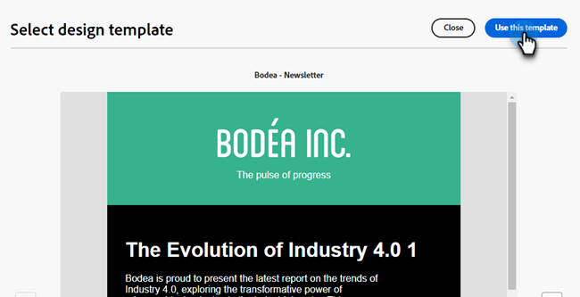
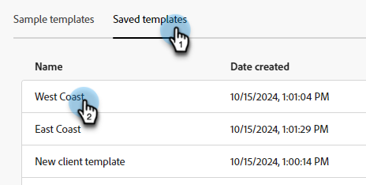

# 電子郵件製作 {#email-authoring}

瞭解如何在新的Marketo Engage電子郵件Designer中建立、個人化和預覽電子郵件。

>[!PREREQUISITES]
>
>若要存取新的電子郵件設計工具，您的Marketo Engage訂閱必須移轉至[Adobe Identity Management系統(IMS)](https://experienceleague.adobe.com/en/docs/marketo/using/product-docs/administration/marketo-with-adobe-identity/adobe-identity-management-overview)。 如果尚未收到您的邀請，而您想要請求加急，請聯絡Adobe客戶團隊（您的客戶經理）或[Marketo支援](https://nation.marketo.com/t5/support/ct-p/Support)。

## 建立電子郵件 {#create-an-email}

來自電子郵件設計工具的電子郵件目前只能在Design Studio中建立並在智慧行銷活動/清單中參照，或直接在電子郵件方案中建立/使用。

>[!BEGINTABS]

>[!TAB 設計工作室]

1. 透過[Adobe Experience Cloud](https://experiencecloud.adobe.com/){target="_blank"}登入Marketo Engage。

1. 在「我的Marketo」中，選取&#x200B;**設計工作室**。

   

1. 在樹狀結構中，選取&#x200B;**電子郵件（新編輯器）**。

   

1. 按一下&#x200B;**建立電子郵件**&#x200B;按鈕。

   

1. 輸入電子郵件名稱和主旨列。 按一下&#x200B;**建立**。

   

>[!TAB 電子郵件程式]

1. 透過[Adobe Experience Cloud](https://experiencecloud.adobe.com/){target="_blank"}登入Marketo Engage。

1. 尋找並選取（或建立）您的電子郵件程式。

   

1. 若要建立新電子郵件，您有兩個選項。 以滑鼠右鍵按一下您的電子郵件方案名稱，然後選取&#x200B;**新增本機資產**，或按一下儀表板上電子郵件方塊中的&#x200B;**+新增電子郵件**&#x200B;按鈕。 在此範例中，我們會執行前者。

   

1. 選取&#x200B;**電子郵件（新編輯器）**。

   

1. 輸入電子郵件名稱和主旨列。 按一下&#x200B;**建立**。

   

>[!ENDTABS]

就是這樣。 現在該設計您的電子郵件了。

## 選擇您的內容型別 {#choose-your-content-type}

1. 在您剛建立的電子郵件中，按一下&#x200B;**新增電子郵件內容**。

   

1. _建立您的電子郵件_&#x200B;頁面已載入。 您可從下列幾個選項中選擇：

* [使用視覺電子郵件編輯器從草稿開始設計](#design-from-scratch)

* [透過HTML或zip檔案匯入您自己的HTML](#import-html)

* [選取現有的範本](#choose-a-template) （我們的其中一個範例或您已儲存的範本）

### 從頭開始設計 {#design-from-scratch}

在電子郵件編輯器中從頭開始時，請使用以下選項來定義您的內容。

1. 在&#x200B;_建立您的電子郵件_&#x200B;頁面中，選取&#x200B;**從草稿開始設計**。

1. 將[結構和內容](#add-structure-and-content)新增至您的電子郵件。

1. 新增[影像](#add-assets)。

1. [個人化](#personalize-content)您的內容。

1. 檢閱連結並[編輯追蹤](#edit-url-tracking)。

### 匯入HTML {#import-html}

您可以匯入現有的HTML內容來設計您的電子郵件。 內容可以是：

* 包含內建樣式表的HTML檔案

* 包含HTML檔案、樣式表(.css)和影像的.zip檔案

>[!NOTE]
>
>.zip檔案結構沒有限制。 不過，參照必須是相對參照，而且符合.zip資料夾的樹狀結構。

1. 在「設計範本」頁面中，選取&#x200B;**匯入HTML**。

1. 拖放所需的HTML或.zip檔案（或從電腦中選取檔案），然後按一下&#x200B;**匯入**。

   

>[!NOTE]
>
>上傳HTML內容時，您的內容會處於相容模式。 在此模式中，您只能個人化您的文字、新增連結或新增資產至您的內容。

您可以使用[視覺化電子郵件編輯器工具](#add-structure-and-content)對匯入的內容進行所需的變更。

### 選擇範本 {#choose-a-template}

有兩種範本可供選擇。

* **範例範本**： Marketo Engage提供四個立即可用的電子郵件範本。

* **儲存的範本**：這些是您使用[範本]功能表從頭建立的範本，或是您建立並選擇儲存為範本的電子郵件。

>[!BEGINTABS]

>[!TAB 範例範本]

選擇其中一個現成的範本，為您的電子郵件範本設計搶先一步。

1. 範例範本標籤預設為開啟。

1. 選取您要使用的範本。

   

1. 按一下&#x200B;**使用此範本**。

   

1. 視需要使用視覺化內容設計工具編輯內容。

>[!TAB 儲存的範本]

1. 按一下「**儲存的範本**」索引標籤，然後選取所需的範本。

   

1. 按一下&#x200B;**使用此範本**。

   

1. 視需要使用視覺化內容設計工具編輯內容。

>[!ENDTABS]

## 新增結構和內容 {#add-structure-and-content}

1. 若要開始建立或修改內容，請從「結構」將專案拖放到畫布上。 在右側的窗格中編輯其設定。

   >[!TIP]
   >
   >選取n：n欄元件以定義您選擇的欄數（介於3到10之間）。 您也可以移動欄下方的箭頭來定義每欄的寬度。

   

   >[!NOTE]
   >
   >每個欄大小不能小於結構元件總寬度的10%。 只能移除空白欄。

1. 從「內容」區段，拖曳至所需的專案上，並將它們拖放至一或多個結構元件中。

   

1. 您可以透過「設定」或「樣式」標籤自訂每個元件。 變更字型、文字樣式、邊界等。

### 新增片段 {#add-fragments}

1. 若要存取您的片段，請選取左側導覽中的&#x200B;_片段_&#x200B;圖示（  ）。

   {width="700" zoomable="yes"}

1. 將任何片段拖放至結構元件的預留位置。

編輯器會在電子郵件結構的區段/元素中轉譯片段。 片段的內容會在結構內動態更新，以顯示內容在電子郵件中的顯示方式。

>[!TIP]
>
>如果您希望片段佔據電子郵件內的整個水準版面，請新增1:1欄結構，然後將片段拖放至其中。

儲存電子郵件後，它會顯示在片段詳細資訊頁面的&#x200B;_[!UICONTROL Used By]_標籤中。 新增到電子郵件範本的片段在範本中無法編輯；來源片段會定義內容。

### 新增Assets {#add-assets}

新增儲存在Marketo Engage執行個體的[影像和檔案](/help/marketo/product-docs/demand-generation/images-and-files/add-images-and-files-to-marketo.md){target="_blank"}區段中的影像。

>[!NOTE]
>
>您目前只能在新設計工具中新增影像，不能新增其他檔案型別。

1. 若要存取影像，請按一下資產選擇器圖示。

   

1. 將所需的影像拖放至結構元件中。

   

   >[!NOTE]
   >
   >若要取代現有的影像，請選取該影像，然後在右側的[設定]索引標籤中按一下&#x200B;**選取資產**。

### 圖層、設定和樣式 {#layers-settings-styles}

開啟導覽樹狀結構以存取特定結構及其欄/元件，以進行更精細的編輯。 若要存取，請按一下導覽樹狀圖示。

下列範例概述在由欄組成的結構元件內調整邊框間距和垂直對齊方式的步驟。

1. 直接在畫布中選取結構元件中的欄，或使用左側顯示的&#x200B;_導覽樹狀結構_。

1. 從欄工具列中，按一下&#x200B;_[!UICONTROL Select a column]_工具並選擇您要編輯的工具。

   您也可以從結構樹中選取它。 該欄的可編輯引數會顯示在右側的&#x200B;_[!UICONTROL Settings]_和_[!UICONTROL Styles]_&#x200B;索引標籤中。

   

1. 若要編輯欄屬性，請按一下右側的&#x200B;_[!UICONTROL Styles]_標籤，並根據您的需求加以變更：

   * 針對&#x200B;**[!UICONTROL Background]**，視需要變更背景顏色。

     清除透明背景的核取方塊。 啟用&#x200B;**[!UICONTROL Background image]**&#x200B;設定以影像作為背景，而非純色。

   * 針對&#x200B;**[!UICONTROL Alignment]**，選取&#x200B;_Top_、_Middle_&#x200B;或&#x200B;_Bottom_&#x200B;圖示。
   * 針對&#x200B;**[!UICONTROL Padding]**，定義所有邊的內距。

     若要調整內距，請選取&#x200B;**[!UICONTROL Different padding for each side]**。 按一下&#x200B;_鎖定_&#x200B;圖示以中斷同步處理。

   * 展開&#x200B;**[!UICONTROL Advanced]**&#x200B;區段以定義欄的內嵌樣式。

   

1. 視需要重複這些步驟，以調整元件中其他欄的對齊與邊框間距。

1. 儲存您的變更。

### 個人化內容 {#personalize-content}

Token在新編輯器中的運作方式與舊版相同，但圖示看起來不同。 以下範例概述如何使用遞補文字新增名字代號。

1. 選取文字元件。 將游標放在您要顯示權杖的位置，然後按一下&#x200B;**新增個人化**&#x200B;圖示。

   

1. 按一下所需的[權杖型別](/help/marketo/product-docs/demand-generation/landing-pages/personalizing-landing-pages/tokens-overview.md){target="_blank"}。

   

1. 找到所需的Token，然後按一下&#x200B;**...**&#x200B;圖示（改為按一下+圖示以新增不含遞補文字的Token）。

   

   >[!NOTE]
   >
   >「遞補文字」是預設值的新編輯器辭彙。 範例： ``{{lead.First Name:default=Friend}}``。 如果您選擇的欄位中沒有該人員的值，建議您這麼做。

1. 設定您的遞補文字，然後按一下[新增]。****

   

1. 按一下&#x200B;**儲存**。

### 編輯URL {#edit-url-tracking}

有時您並不想在電子郵件中的連結上啟用Marketo追蹤URL。 當目的地頁面不支援URL引數並且可能導致連結中斷時，這項功能會很有用。

1. 按一下「連結」圖示，以顯示電子郵件中的所有URL。

   

1. 按一下鉛筆圖示即可編輯任何所需連結的追蹤。

1. 按一下&#x200B;**追蹤型別**&#x200B;下拉式清單，並選取專案。

   

   <table><tbody>
     <tr>
       <td><b>不使用mkt_tok追蹤</b></td>
       <td>無需在目的地URL中使用mkt_tok查詢字串引數，即可在URL上啟用追蹤</td>
     </tr>
     <tr>
       <td><b>使用mkt_tok追蹤</b></td>
       <td>在目標URL中使用mkt_tok查詢字串引數，以在URL上啟用追蹤</td>
     </tr>
     <tr>
       <td><b>不要追蹤</b></td>
       <td>停用URL追蹤</td>
     </tr>
   </tbody>
   </table>

1. 您可以選擇為URL加上標籤或新增標籤。

1. 完成時，按一下&#x200B;**儲存**。

## 檢查警報 {#check-alerts}

當您設計內容時，如果缺少關鍵設定，畫面右上方會顯示警報。

警報有兩種型別：

**個警告**

警告會參照建議和最佳實務，例如：

* **電子郵件內文中不存在選擇退出的連結**：雖然取消訂閱連結是必要的，但最佳實務是將它們新增至您的電子郵件內文中。

>[!NOTE]
>
>[營運電子郵件](/help/marketo/product-docs/email-marketing/general/functions-in-the-editor/make-an-email-operational.md) （非行銷）不需要新增取消訂閱選項。

* **HTML的文字版本是空的**：您必須為無法顯示HTML內容時定義電子郵件內文的文字版本。

* **電子郵件內文中出現空白連結**：驗證電子郵件中的所有連結是否正確。

* **電子郵件大小已超過100KB的限制**：若要取得最佳傳遞，請確定您的電子郵件大小不超過100KB。

**個錯誤**

在解決錯誤之前，您無法傳送或測試電子郵件：

* **主旨列遺失**：需要電子郵件主旨列。

* **郵件的電子郵件版本是空的**：尚未設定電子郵件內容時，會發生此錯誤。

## 測試您的電子郵件 {#test-your-email}

定義訊息內容後，您可以使用測試設定檔來預覽內容、傳送校樣，以及控制內容在熱門的案頭、行動及網頁型使用者端中的轉譯方式。 如果您已插入個人化內容，您可以使用測試設定檔資料檢查其在訊息中的顯示方式。

若要預覽您的電子郵件內容，請按一下[模擬內容] **，然後新增測試設定檔，以使用測試設定檔資料檢查您的訊息。**

## 參考電子郵件 {#reference-an-email}

電子郵件Designer電子郵件可在電子郵件、參與、預設和事件程式中存取（互動式網路研討會程式除外）。 如果您在Design Studio中建立電子郵件，則可像使用任何其他電子郵件一樣，從「智慧行銷活動」和/或「智慧清單」參考該電子郵件。

* 依照一般步驟](/help/marketo/product-docs/core-marketo-concepts/smart-lists-and-static-lists/creating-a-smart-list/create-a-smart-list.md)，由[在智慧清單中參照它。

* 按照一般步驟](/help/marketo/product-docs/core-marketo-concepts/smart-campaigns/creating-a-smart-campaign/create-a-new-smart-campaign.md)，由[在Smart Campaign中參考它。

>[!NOTE]
>
>只能參考已儲存的電子郵件。 新電子郵件設計工具中沒有「已核准」狀態。

>[!MORELIKETHIS]
>
>[電子郵件範本](/help/marketo/product-docs/email-marketing/email-designer/email-template-authoring.md){target="_blank"}：瞭解如何在新的設計工具中建立、設計和存取電子郵件範本。
