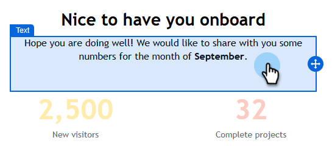

# 電子郵件共同作業 {#email-collaboration}

電子郵件共同作業和註解可讓行銷團隊在Adobe Marketo Engage Email Designer中順暢地檢閱、討論及完成電子郵件資產。 您可以評論、建議編輯和即時解決意見反應，而不是透過外部工具（例如聊天、電子郵件對話、試算表等）分享草稿。 這能簡化工作流程、減少錯誤，並確保利害關係人在傳送電子郵件行銷活動之前保持一致。

## 權限 {#permissions}

擁有電子郵件資產編輯許可權的使用者將能夠評論、標籤和檢視評論。 擁有電子郵件資產唯讀許可權的使用者&#x200B;**無法**&#x200B;新增或檢視註解。

## 新增註解 {#add-comments}

1. 在電子郵件Designer中建立或編輯電子郵件時，按一下任何可編輯區段上的結構、欄或內容（文字、影像、按鈕等）。

   

1. 按一下註解圖示。

   

1. 輸入意見回饋、問題或建議。

   

>[!NOTE]
>
>使用@mentions標籤團隊成員(例如「@John，請更新冬季電子報」)。

## 檢視所有註解 {#view-all-comments}

1. 按一下右側的&#x200B;_Collaboration_&#x200B;圖示。

   

1. 快速回覆或喜歡註解。

   

1. 按一下&#x200B;**...**&#x200B;圖示以取得更多動作。

   

## 解決評論 {#resolve-comments}

每個註解對話串都包含：

* 回覆：繼續討論
* 解決：將評論標籤為已解決
* 取消解析：如果需要進一步編輯
* 移除：將註解從其設計元素中移除
* 刪除：永久刪除評論

>[!NOTE]
>
>已解析的執行緒預設為隱藏，但可在篩選器中選取所需的執行緒來重新造訪。

## 通知 {#notifications}

被標籤的團隊成員會透過電子郵件和/或脈衝通知接收通知。

會針對下列專案觸發通知：

* 新註解
* 提及次數(@username)
* 解析度

## 最佳做法 {#best-practices}

* 使用@mentions確保意見可以快速到達正確的團隊成員。

* 將相關的意見反應分組為單一註解對話串，而非多個分散的註解。

* 一律解決註解，以維持簡潔的工作流程。

* 儲存最終核准的版本，以供遵循性/稽核之用。
