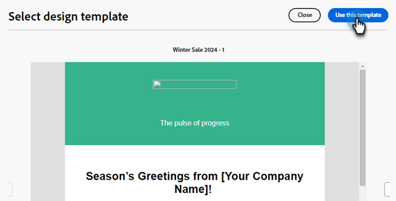
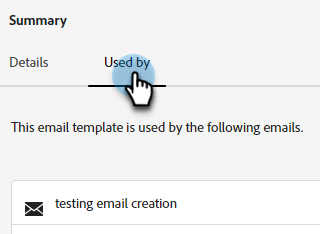

# 電子郵件範本 {#email-templates}

為了加速並改善設計流程，您可以建立獨立的電子郵件範本，以輕鬆重複使用自訂內容。

>[!PREREQUISITES]
>
>若要存取新的電子郵件設計工具，您的Marketo Engage訂閱必須移轉至[AdobeIdentity Management系統(IMS)](https://experienceleague.adobe.com/en/docs/marketo/using/product-docs/administration/marketo-with-adobe-identity/adobe-identity-management-overview)。 如果尚未收到您的請求，而您想要請求加急，請聯絡Adobe客戶團隊（您的客戶經理）或[Marketo支援](https://nation.marketo.com/t5/support/ct-p/Support)。

>[!NOTE]
>
>新電子郵件設計工具中的電子郵件範本只能用來建立新電子郵件設計工具中的電子郵件。 舊版電子郵件編輯器中無法參照這些引數。

## 建立電子郵件範本 {#create-an-email-template}

1. 透過[Adobe Experience Cloud](https://experiencecloud.adobe.com/){target="_blank"}登入Marketo Engage。

1. 在「我的Marketo」中，選取&#x200B;**設計工作室**。

   

1. 在樹狀結構中，選取&#x200B;**電子郵件範本（新編輯器）**。

   

1. 按一下&#x200B;**建立範本**&#x200B;按鈕。

   

1. 輸入範本名稱和說明（選擇性）。 按一下&#x200B;**建立**。

   

## 設計您的範本 {#design-your-template}

在&#x200B;_設計您的範本_&#x200B;頁面中，您可以選擇幾個選項。 [從頭開始設計](#design-from-scratch)、[匯入您自己的HTML](#import-html)，或[選取現有的範本](#choose-a-template) （我們的範例或您已儲存的範本）。

### 從頭開始設計 {#design-from-scratch}

透過簡單的拖放動作新增和移動結構元素來定義您的內容。

1. 在&#x200B;_設計您的範本_&#x200B;頁面中，選取&#x200B;**從頭開始設計**。

1. 新增[結構和內容](#add-structure-and-content)。

### 匯入您的HTML {#import-your-html}

您可以匯入現有的HTML內容來設計您的電子郵件範本。 內容可以是：

* 包含內建樣式表的HTML檔案

* 包含HTML檔案、樣式表(.css)和影像的.zip檔案

>[!NOTE]
>
>.zip檔案結構沒有限制。 不過，參照必須是相對參照，而且符合.zip資料夾的樹狀結構。

1. 在&#x200B;_設計您的範本_&#x200B;頁面中，選取&#x200B;**匯入HTML**。

1. 拖放所需的HTML或.zip檔案（或從電腦中選取檔案），然後按一下&#x200B;**匯入**。

   

   >[!NOTE]
   >
   >上傳HTML內容時，您的內容將處於相容模式。 在此模式中，您只能個人化您的文字、新增連結或新增資產至您的內容。

1. 若要利用電子郵件Designer內容元件，請按一下&#x200B;**HTML轉換器**&#x200B;標籤，然後按一下&#x200B;**轉換**。

   >[!CAUTION]
   >
   >使用`<table>`標籤做為HTML檔案中的第一個圖層可能會造成樣式遺失，包括上層圖層標籤中的背景和寬度設定。

您現在可以根據需要使用視覺化電子郵件編輯器個人化匯入的檔案。

### 選擇範本 {#choose-a-template}

有兩種範本可供選擇。

* **範例範本**： Marketo Engage提供四個立即可用的電子郵件範本。

* **儲存的範本**：這些是您使用[範本]功能表從頭建立的範本，或是您建立並選擇儲存為範本的電子郵件。

>[!BEGINTABS]

>[!TAB 範例範本]

選擇其中一個現成的範本，為您的電子郵件範本設計搶先一步。

1. 範例範本標籤預設為開啟。

1. 選取您要使用的範本。

   

1. 按一下&#x200B;**使用此範本**。

   

1. 視需要使用視覺化內容設計工具編輯內容。

>[!TAB 儲存的範本]

1. 按一下「**儲存的範本**」索引標籤，然後選取所需的範本。

   

1. 按一下&#x200B;**使用此範本**。

   

1. 視需要使用視覺化內容設計工具編輯內容。

>[!ENDTABS]

## 新增結構和內容 {#add-structure-and-content}

1. 若要開始建立或修改內容，請從「結構」將專案拖放到畫布上。 在右側的窗格中編輯其設定。

   >[!TIP]
   >
   >選取n：n欄元件以定義您選擇的欄數（介於3到10之間）。 您也可以移動欄下方的箭頭來定義每欄的寬度。

   

   >[!NOTE]
   >
   >每個欄大小不能小於結構元件總寬度的10%。 只能移除空白欄。

1. 從「內容」區段，拖曳至所需的專案上，並將它們拖放至一或多個結構元件中。

   

1. 您可以透過「設定」或「樣式」標籤自訂每個元件。 變更字型、文字樣式、邊界等。

### 新增片段 {#add-fragments}

1. 若要存取您的片段，請選取左側導覽中的&#x200B;_片段_&#x200B;圖示（  ）。

   {width="700" zoomable="yes"}

1. 將任何片段拖放至結構元件的預留位置。

編輯器會在電子郵件結構的區段/元素中轉譯片段。 片段的內容會在結構內動態更新，以顯示內容在電子郵件中的顯示方式。

>[!TIP]
>
>如果您希望片段佔據電子郵件內的整個水準版面，請新增1:1欄結構，然後將片段拖放至其中。

儲存電子郵件後，它出現在片段詳細資訊頁面的&#x200B;_[!UICONTROL 使用者]_&#x200B;索引標籤中。 新增到電子郵件範本的片段在範本中無法編輯；來源片段會定義內容。

### 新增Assets {#add-assets}

新增儲存在Marketo Engage執行個體的[影像和檔案](/help/marketo/product-docs/demand-generation/images-and-files/add-images-and-files-to-marketo.md){target="_blank"}區段中的影像。

>[!NOTE]
>
>您目前只能在新設計工具中新增影像，不能新增其他檔案型別。

1. 若要存取影像，請按一下資產選擇器圖示。

   

1. 將所需的影像拖放至結構元件中。

   

   >[!NOTE]
   >
   >若要取代現有的影像，請選取該影像，然後在右側的[設定]索引標籤中按一下&#x200B;**選取資產**。

### 圖層、設定和樣式 {#layers-settings-styles}

開啟導覽樹狀結構以存取特定結構及其欄/元件，以進行更精細的編輯。 若要存取，請按一下導覽樹狀圖示。

下列範例概述在由欄組成的結構元件內調整邊框間距和垂直對齊方式的步驟。

1. 直接在畫布中選取結構元件中的欄，或使用左側顯示的&#x200B;_導覽樹狀結構_。

1. 在欄工具列中，按一下&#x200B;_[!UICONTROL 選取欄]_&#x200B;工具，然後選擇您要編輯的工具。

   您也可以從結構樹中選取它。 該欄的可編輯引數會顯示在右側的&#x200B;_[!UICONTROL 設定]_&#x200B;和&#x200B;_[!UICONTROL 樣式]_&#x200B;索引標籤中。

   

1. 若要編輯欄屬性，請按一下右側的&#x200B;_[!UICONTROL 樣式]_&#x200B;索引標籤，並根據您的需求加以變更：

   * 針對&#x200B;**[!UICONTROL 背景]**，視需要變更背景顏色。

     清除透明背景的核取方塊。 啟用&#x200B;**[!UICONTROL 背景影像]**&#x200B;設定，以使用影像做為背景，而非純色。

   * 針對&#x200B;**[!UICONTROL 對齊]**，請選取&#x200B;_上_、_中_&#x200B;或&#x200B;_下_&#x200B;圖示。
   * 針對&#x200B;**[!UICONTROL 內距]**，定義所有邊的內距。

     如果要調整內距，請選取&#x200B;**[!UICONTROL 每一邊不同的內距]**。 按一下&#x200B;_鎖定_&#x200B;圖示以中斷同步處理。

   * 展開&#x200B;**[!UICONTROL 進階]**&#x200B;區段以定義資料行的內嵌樣式。

   

1. 視需要重複這些步驟，以調整元件中其他欄的對齊與邊框間距。

1. 儲存您的變更。

### 個人化內容 {#personalize-content}

Token在新編輯器中的運作方式與舊版相同，但圖示看起來不同。 以下範例概述如何使用遞補文字新增名字代號。

1. 選取文字元件。 將游標放在您要顯示權杖的位置，然後按一下&#x200B;**新增個人化**&#x200B;圖示。

   

1. 按一下所需的[權杖型別](/help/marketo/product-docs/demand-generation/landing-pages/personalizing-landing-pages/tokens-overview.md){target="_blank"}。

   

1. 找到所需的Token，然後按一下&#x200B;**...**&#x200B;圖示（改為按一下+圖示以新增不含遞補文字的Token）。

   

   >[!NOTE]
   >
   >「遞補文字」是預設值的新編輯器辭彙。 範例： ``{{lead.First Name:default=Friend}}``。 如果您選擇的欄位中沒有該人員的值，建議您這麼做。

1. 設定您的遞補文字，然後按一下[新增]。****

   

1. 按一下&#x200B;**儲存**。

### 編輯URL {#edit-url-tracking}

有時您並不想在電子郵件中的連結上啟用Marketo追蹤URL。 當目的地頁面不支援URL引數並且可能導致連結中斷時，這項功能會很有用。

1. 按一下「連結」圖示，以顯示電子郵件中的所有URL。

   

1. 按一下鉛筆圖示即可編輯任何所需連結的追蹤。

1. 按一下&#x200B;**追蹤型別**&#x200B;下拉式清單，並選取專案。

   

   <table><tbody>
     <tr>
       <td><b>不使用mkt_tok追蹤</b></td>
       <td>無需在目的地URL中使用mkt_tok查詢字串引數，即可在URL上啟用追蹤</td>
     </tr>
     <tr>
       <td><b>使用mkt_tok追蹤</b></td>
       <td>在目標URL中使用mkt_tok查詢字串引數，以在URL上啟用追蹤</td>
     </tr>
     <tr>
       <td><b>不要追蹤</b></td>
       <td>停用URL追蹤</td>
     </tr>
   </tbody>
   </table>

1. 您可以選擇為URL加上標籤或新增標籤。

1. 完成時，按一下&#x200B;**儲存**。

### 檢視選項 {#view-options}

善用視覺化電子郵件編輯器中可用的檢視和內容驗證選項。

* 使用預設的縮放選項放大/縮小內容。

* 檢視案頭、行動裝置或純文字/純文字的內容。

   * 按一下即時檢視（眼睛）圖示，即可跨裝置預覽內容。

   * 選取其中一個現成可用的裝置，或輸入自訂維度來預覽您的內容。

### 更多選項 {#more-options}

從內容編輯器中的&#x200B;**更多**&#x200B;選項，您可以執行下列動作：

* **重設範本**：選取此項可將視覺化電子郵件設計工具畫布清除為空白並重新啟動建立內容。

* **變更您的設計**：返回&#x200B;_設計您的範本_&#x200B;頁面。 從這裡，您可以按照[設計您的範本](#design-your-template)一節中的概述執行任何動作。

* **匯出HTML**：將視覺畫布中的內容以HTML格式下載至本機系統，並封裝成zip檔。

## 檢視範本詳細資訊 {#view-template-details}

在&#x200B;_電子郵件範本_&#x200B;清單頁面中，按一下電子郵件範本的名稱以檢視其詳細資料。

(assets/view-template-details-1.png

可編輯名稱和說明等基本細節。 在您編輯的欄位外按一下，以儲存變更。

按一下&#x200B;**更多**&#x200B;以快速刪除或複製您的範本。

如果有任何使用中的警示（電子郵件範本的錯誤/警告），請按一下[警示]以檢視資訊。

>[!NOTE]
>
>雖然這些警報不會禁止使用電子郵件範本來建立電子郵件，但資訊可提供在電子郵件可用於傳送之前可能無法使用的專案以及所需更新的可見度。

## 檢視參考使用的電子郵件範本 {#email-template-used-by-references}

在電子郵件範本摘要中，按一下&#x200B;**使用者**&#x200B;索引標籤，以檢視Marketo Engage中此電子郵件範本使用位置的詳細資訊。

## 編輯電子郵件範本 {#edit-email-templates}

此動作可從以下位置執行：

* 詳細資訊標籤 — 按一下&#x200B;**編輯電子郵件範本**。

此動作會根據電子郵件範本的上次儲存狀態，帶您前往&#x200B;_設計您的範本_&#x200B;頁面或視覺內容編輯器頁面。 您可以在此處視需要編輯您的電子郵件範本內容。 請參閱建立電子郵件範本，以取得有關編輯選項的資訊。

## 重複的電子郵件範本 {#duplicate-email-templates}

複製電子郵件範本有兩個方法：

* 從右側的電子郵件範本詳細資料中，按一下&#x200B;**更多**&#x200B;並選取&#x200B;**複製**。

  

* 在&#x200B;_電子郵件範本_&#x200B;清單頁面中，按一下所需電子郵件範本的[更多動作]圖示（三個點），然後選擇[複製]。****

在對話方塊中，輸入唯一名稱與選擇性說明。 完成時，按一下&#x200B;**複製**。

然後，複製的電子郵件範本會出現在&#x200B;_電子郵件範本_&#x200B;清單頁面中。

## 刪除電子郵件範本 {#delete-email-templates}

有兩種方式可刪除電子郵件範本。

>[!CAUTION]
>
>無法刪除電子郵件範本。

* 從右側的電子郵件範本詳細資料中，按一下&#x200B;**更多**&#x200B;並選取&#x200B;**刪除**。

  

* 在&#x200B;_電子郵件範本_&#x200B;清單頁面中，按一下所需電子郵件範本的[更多動作]圖示（三個點），然後選擇&#x200B;**刪除**。

## 大量動作 {#bulk-actions}

從&#x200B;_電子郵件範本_&#x200B;清單頁面，選取左邊的核取方塊以選取多個範本。 底端會出現橫幅。

**刪除**：一次最多可以刪除20個範本。 確認對話方塊可讓您中止動作或確認刪除。

>[!MORELIKETHIS]
>
>[電子郵件製作](/help/marketo/product-docs/email-marketing/email-designer/email-authoring.md){target="_blank"}：瞭解如何使用新設計工具建立、設計和參考電子郵件。
