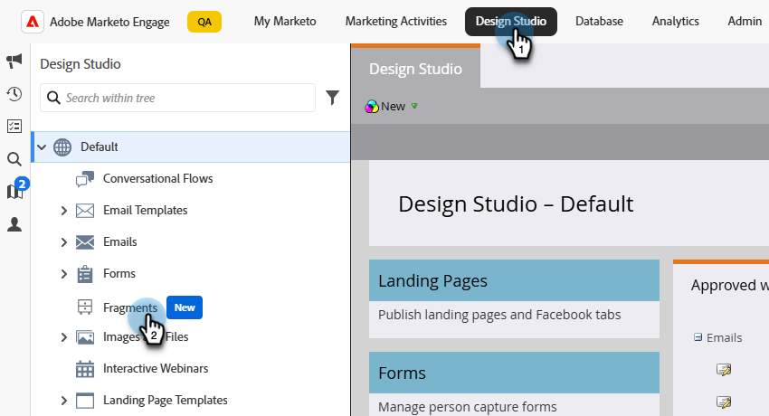
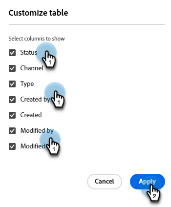
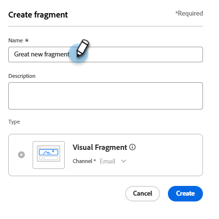
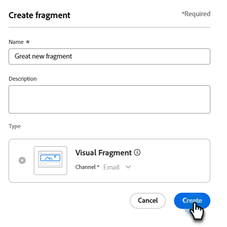

# 片段

片段是可重複使用的元件，可在一或多個電子郵件和電子郵件範本中參照。 這通常是可快速插入專案中的內容區塊（文字、影像或兩者）。 透過此功能，您可以預先建置多個自訂內容區塊，以組合電子郵件內容來改進設計流程。 常見的使用案例包括電子郵件的頁首/頁尾內容區塊、事件邀請橫幅、季節性訊息等。

若要在工作流程中善用片段：

* _建立片段_ — 從頭開始建立視覺化片段，或是從視覺化內容編輯器將內容儲存為片段。
* _重複使用片段_ — 視需要在您的內容中多次使用這些片段。

## 視覺片段 {#visual-fragments}

視覺片段是預先定義的視覺化區塊，可建置（使用視覺化內容編輯器）於多個電子郵件或電子郵件範本中重複使用。

## 存取及管理片段 {#access-and-manage-fragments}

若要存取視覺化片段，請前往Marketo Engage中的&#x200B;**Design Studio**。 在左側的樹狀結構中，按一下&#x200B;**[!UICONTROL 片段（新增）]**。

{width="600" zoomable="yes"}

依預設，資料表是依&#x200B;_[!UICONTROL 已修改]_&#x200B;資料行排序。 按一下其他欄標題以變更表格排序依據。 再按一下相同標題，在升序和降序之間切換。

### 尋找和篩選

使用搜尋列依名稱尋找片段。 按一下&#x200B;_篩選器_&#x200B;圖示（ ）以顯示可用的篩選器選項，並選擇所需的設定。

{width="700" zoomable="yes"}

### 自訂欄 {#customize-the-column-display}

按一下右上角的&#x200B;_自訂表格_&#x200B;圖示（），自訂您要顯示在表格中的欄。

選取您想要的資料行，然後按一下&#x200B;**[!UICONTROL 套用]**。

{width="400" zoomable="yes"}

### 片段狀態 {#fragment-status}

片段狀態會決定其是否可用於電子郵件或電子郵件範本，以及您可以對其進行的變更。

<table>
<tbody>
  <tr>
    <td width="25%"><b>草稿</b></td>
    <td width="75%">當您建立片段時，它處於草稿狀態。 在您發佈以供電子郵件或電子郵件範本使用之前，這仍然是草稿。
    
可用的動作：
    <li>編輯所有詳細資料</li>
    <li>在視覺化設計工具中編輯</li>
    <li>發佈</li>
    <li>複製</li>
    <li>刪除</li>
  </td>
  <tr>
    <td><b>發佈日期</b></td>
    <td>當您發佈片段時，該片段將可用於電子郵件或電子郵件範本。 在視覺化設計工具中無法修改已發佈的片段內容。
    
可用的動作：
    <li>編輯說明</li>
    <li>新增至電子郵件或範本</li>
    <li>建立草稿版本</li>
    <li>複製</li>
    <li>刪除（若未使用）</li>
    </td>
  </tr>
  <tr>
    <td style="width:25%"><b>已與草稿一起發佈</b></td>
    <td style="width:75%">當您從已發佈的片段建立草稿時，已發佈的版本仍可在電子郵件或電子郵件範本中使用，且草稿內容可在視覺化設計工具中修改。 如果您發佈草稿版本，草稿版本會取代目前發佈的版本，而且內容會在<i>所有</i>使用草稿的電子郵件和電子郵件範本中更新。 
    
可用的動作：
    <li>編輯說明</li>
    <li>新增至電子郵件或範本</li>
    <li>在視覺化設計工具中編輯草稿版本</li>
    <li>發佈草稿版本</li>
    <li>複製</li>
    <li>刪除（若未使用）</li>
    </td>
  </tr>
</tbody>
</table>

## 建立內容片段 {#create-fragments}

1. 若要建立新的視覺片段，請按一下片段清單頁面右上角的&#x200B;**[!UICONTROL 建立片段]**。

   {width="700" zoomable="yes"}

1. 為您的片段提供&#x200B;**[!UICONTROL 名稱]**&#x200B;和選用的&#x200B;**[!UICONTROL 描述]**。

   _片段需求_

   * 名稱：最多100個字元，必須是唯一的，不區分大小寫
   * 說明：最多300個字元
   * 字元：可使用字母、數字和特殊字元
   * 保留的字元是&#x200B;**_不允許_**： `\ / : * ? " < > |`

   {width="400" zoomable="yes"}

1. 按一下&#x200B;**[!UICONTROL 建立]**。

   {width="400" zoomable="yes"}

   >[!NOTE]
   >
   >目前無法修改片段的&#x200B;**型別**。

   視覺化設計工具會以空白畫布開啟。

1. 使用[內容設計工具](/help/marketo/product-docs/email-marketing/email-designer/email-authoring.md#add-structure-and-content){target="_blank"}來建立視覺片段內容。

1. 隨時按一下&#x200B;**[!UICONTROL 儲存]**&#x200B;以儲存草稿片段。

1. 當您準備好讓片段可用於電子郵件或電子郵件範本時，請按一下[發佈]。****

## 檢視片段詳細資訊 {#view-fragment-details}

按一下清單頁面中任何片段的名稱，以開啟片段詳細資訊頁面。 您可以選擇編輯片段、將其重新命名或更新其說明。 進行更新，然後按一下名稱或說明欄位外部以儲存變更。

>[!NOTE]
>
>如果電子郵件或電子郵件範本正在使用已發佈的片段，則您無法變更其名稱或編輯內容。 如果您想對片段進行變更，可以建立草稿版本。

{width="600" zoomable="yes"}

按一下「**[!UICONTROL 編輯片段]**」以在視覺內容編輯器中開啟片段。

隨時按一下左上方的&#x200B;_上一步_&#x200B;箭頭以結束檢視，此箭頭會返回&#x200B;_片段_&#x200B;清單頁面。

## 檢視片段使用者參考 {#view-fragment-used-by-references}

在片段詳細資訊頁面中，按一下&#x200B;**[!UICONTROL 使用者]**&#x200B;標籤以檢視Marketo Engage中片段使用位置的詳細資訊。

>[!IMPORTANT]
>
>無法刪除電子郵件或電子郵件範本目前正在使用的片段。

{width="600" zoomable="yes"}的參考使用

按一下連結，開啟使用片段之對應的電子郵件或電子郵件範本。

## 刪除片段 {#delete-fragments}

由於無法刪除電子郵件或電子郵件範本目前正在使用的片段，在起始片段移除之前，請務必檢查&#x200B;_used-by_&#x200B;參考。 此外，移除無法復原，因此在起始刪除動作前請先檢查。

您可以使用下列其中一種方法來刪除片段：

* 從右側的片段詳細資料中，按一下&#x200B;**[!UICONTROL 刪除]**。
* 從&#x200B;_[!UICONTROL 片段]_&#x200B;清單頁面，按一下片段旁的省略符號，然後選擇&#x200B;**[!UICONTROL 刪除]**。

此動作會開啟確認對話方塊。 您可以按一下&#x200B;**[!UICONTROL 取消]**，或按一下&#x200B;**[!UICONTROL 刪除]**&#x200B;確認刪除，以中止程式。

{width="400"}

## 編輯片段 {#edit-fragments}

對片段的編輯取決於其目前狀態：

* 當片段處於&#x200B;_草稿_&#x200B;狀態時，您可以編輯其任何詳細資訊和視覺內容。
* 當片段處於&#x200B;_已發佈_&#x200B;狀態時，您可以編輯片段說明，但不能編輯名稱。 您無法編輯視覺內容。
* 當片段處於&#x200B;_以草稿_&#x200B;狀態發佈時，編輯詳細資料僅限於說明。 您也可以編輯草稿版本的視覺內容。

>[!BEGINTABS]

>[!TAB 草稿]

1. 從&#x200B;_[!UICONTROL 片段]_&#x200B;清單頁面，按一下片段名稱以開啟。

   接著會顯示視覺內容的預覽，片段詳細資訊位於右側。

1. 進行所需的編輯。

   {width="600" zoomable="yes"}

1. 若要變更視覺化設計工具中的內容，請按一下[編輯片段]。**** 完成時，按一下&#x200B;**儲存**。

1. 按一下「**[!UICONTROL 儲存]**」或「**[!UICONTROL 儲存並關閉]**」以返回片段詳細資料。

1. 當您想要讓片段可用於電子郵件或電子郵件範本時，請按一下[發佈]。****

>[!TAB 已發佈]

1. 從&#x200B;_[!UICONTROL 片段]_&#x200B;清單頁面，按一下片段名稱以開啟。

   接著會顯示視覺內容的預覽，片段詳細資訊位於右側。

1. 視需要修改說明。

   針對已發佈的片段，無法變更所有其他詳細資料。

1. 若要更新內容，請按一下右上方的&#x200B;**[!UICONTROL 建立草稿版本]**。

   在對話方塊中按一下「**[!UICONTROL 確定]**」，在視覺化設計工具中開啟草稿版本。 您可以視需要變更`image source`公斤 — 此處連結。

   {width="300"}

1. 按一下「**[!UICONTROL 儲存]**」或「**[!UICONTROL 儲存並關閉]**」以返回片段詳細資料。

1. 當您想要讓片段可用於電子郵件或電子郵件範本時，請按一下[發佈]。****

>[!NOTE]
>
>當您發佈草稿版本時，草稿版本會取代目前發佈的版本，而內容會更新到已使用草稿的電子郵件和電子郵件範本中。

>[!TAB 已發佈草稿]

有兩種方式可開啟草稿版本，以從&#x200B;_[!UICONTROL 片段]_&#x200B;清單頁面進行編輯：

* 按一下片段名稱旁的&#x200B;_更多_&#x200B;圖示(**...**)，然後選擇&#x200B;**[!UICONTROL 開啟草稿版本]**。

  {width="300"}

* 按一下片段名稱以開啟。 然後，按一下右上方的&#x200B;**[!UICONTROL 開啟草稿版本]**。

將顯示草稿版本的視覺內容預覽，片段詳細資訊在右側。

若要更新內容：

1. 按一下右上方的&#x200B;**[!UICONTROL 編輯片段]**。 完成時，按一下&#x200B;**儲存**。

1. 按一下「**[!UICONTROL 儲存]**」或「**[!UICONTROL 儲存並關閉]**」以返回片段詳細資料。

1. 當您想要讓片段可用於電子郵件或電子郵件範本時，請按一下[發佈]。****

>[!NOTE]
>
>當您發佈草稿版本時，草稿版本會取代目前發佈的版本，而內容會更新到已使用草稿的電子郵件和電子郵件範本中。

>[!ENDTABS]

## 重複片段 {#duplicate-fragments}

您可以使用以下任一方法復製片段：

* 從&#x200B;_[!UICONTROL 片段]_&#x200B;清單頁面，按一下片段名稱旁的&#x200B;_更多_&#x200B;圖示(**...**)，然後選擇&#x200B;**[!UICONTROL 複製]**。
* 在片段詳細資料頁面的右上方，按一下&#x200B;**[!UICONTROL ...更多]**&#x200B;並選擇&#x200B;**[!UICONTROL 複製]**。

{width="600" zoomable="yes"}

在對話方塊中，輸入唯一名稱與選擇性說明。 按一下&#x200B;**[!UICONTROL 複製]**。

{width="400"}

然後，複製的片段會顯示在&#x200B;_片段_&#x200B;清單中。

## 從電子郵件或範本內容儲存新片段 {#save-a-new-fragment-from-email-or-template-content}

在視覺內容編輯器中建立/編輯電子郵件或電子郵件範本時，您可以將全部或部分內容儲存為片段以供重複使用。

1. 若要將內容另存為片段，請按一下[其他] ****，然後選擇[另存為片段] ]**。**[!UICONTROL 

1. 選取要包含在片段中的不同元素。

   按住Shift或Control按鈕，選取多個結構。

   您只能選取彼此相鄰的結構。

1. 選取內容後，按一下右上角的&#x200B;**[!UICONTROL 建立]**。

1. 在對話方塊中，輸入片段的名稱和選擇性說明，然後按一下&#x200B;**[!UICONTROL 建立]**。

然後片段會顯示在&#x200B;_片段_&#x200B;清單頁面中，並可用於電子郵件和電子郵件範本。

## 將視覺化片段新增至您的電子郵件或範本內容 {#add-visual-fragments-to-your-email-or-template-content}

片段是專為重複使用而設計。 您最多可以在電子郵件或電子郵件範本中新增30個，而且它們只能巢狀內嵌一個層級。

* [新增片段至電子郵件](/help/marketo/product-docs/email-marketing/email-designer/email-authoring.md#add-fragments)

* [新增片段至電子郵件範本](/help/marketo/product-docs/email-marketing/email-designer/email-template-authoring.md#add-fragments)

片段的內容會在結構內動態更新，以呈現內容在電子郵件中如何顯示的視覺效果。

>[!TIP]
>
>如果您希望片段佔據電子郵件內的整個水準版面，請新增[!UICONTROL 1:1欄]結構，然後將片段拖放到其中。

儲存電子郵件/電子郵件範本後，當選取&#x200B;_[!UICONTROL 使用者]_&#x200B;索引標籤時，其會出現在片段詳細資訊頁面中。 新增的片段在電子郵件或範本中無法編輯 — 發佈的來源片段會定義內容。

## 電子郵件和範本製作期間的片段動作 {#fragment-actions-during-email-and-template-authoring}

將片段新增至電子郵件或電子郵件範本時，無法在電子郵件或範本中編輯其內容。 不過，您可以套用下列動作：

* **[!UICONTROL 刪除]** — 這會從目前的電子郵件或電子郵件範本內容中移除片段（片段來源不受影響）。
* **[!UICONTROL 重新整理]** — 這會重新整理目前電子郵件或電子郵件範本中片段的內容。 當您想要反映新增到電子郵件或電子郵件範本後對片段的任何最近編輯時，重新整理會很有用。
* **[!UICONTROL 重複]** — 這會在編輯器內的相同電子郵件或電子郵件範本中重複片段。 複製的片段會新增至原始片段的正下方。
* **[!UICONTROL 開啟片段]** — 這會開啟新的瀏覽器索引標籤，其中包含片段編輯器頁面和詳細資訊。
* **[!UICONTROL 中斷繼承]** — 這會中斷來自來源的片段繼承（及其變更）。 使用此動作，在電子郵件或電子郵件範本中讓片段內容成為獨立且可編輯的內容。 此動作也會從原始片段的&#x200B;_使用者_&#x200B;參考中移除電子郵件或電子郵件範本。

在編輯器頁面上選取片段時，可以從右側的內容工具列和屬性面板中取得這些動作。

{width="600" zoomable="yes"}

>[!MORELIKETHIS]
>
>[可自訂的片段](/help/marketo/product-docs/email-marketing/email-designer/customizable-fragments.md)
