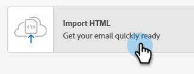
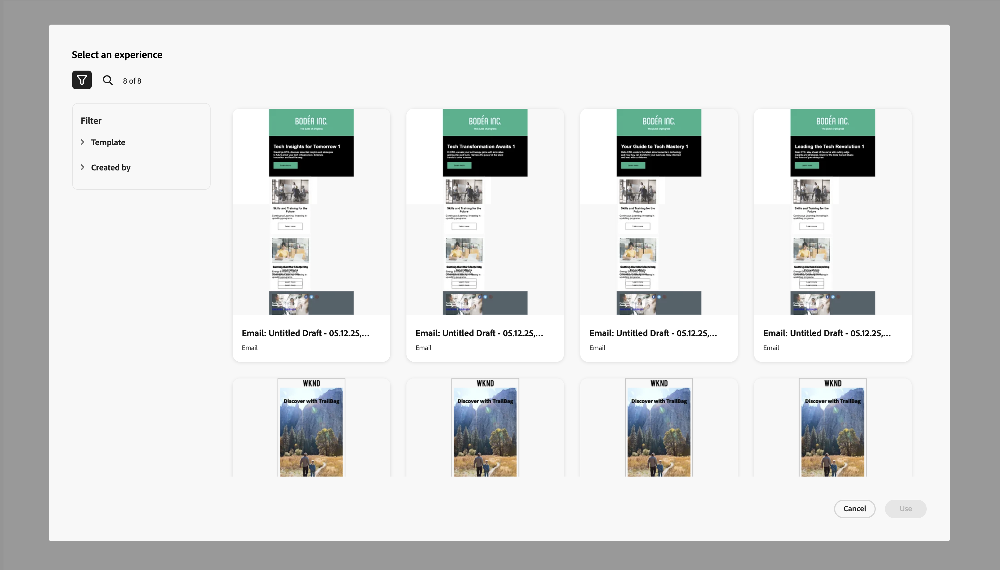

# 適用於Marketo Engage的GenStudio整合 {#genstudio-integration-for-marketo-engage}

Adobe GenStudio for Performance Marketing是創作AI優先的應用程式，可讓您建立自己的廣告和電子郵件，以推動具影響力的個人化行銷活動，符合您的品牌標準並符合您的企業政策。 它提供許多工具，可簡化內容建立的複雜性。

>[!INFO]
>
>深入瞭解[GenStudio for Performance Marketing](https://experienceleague.adobe.com/zh-hant/docs/genstudio-for-performance-marketing/user-guide/home){target="_blank"}。

## 利用Marketo Engage中的GenStudio功能 {#leverage-genstudio-capabilities}

透過這項整合，使用Marketo Engage開發和自動化電子郵件促銷活動的技術行銷人員可以與使用GenStudio建立內容的效能行銷人員合作。 這可讓他們輕鬆地將GenStudio中的品牌上內容整合到Marketo Engage中。

## 將HTML範本從Marketo Engage匯出至GenStudio {#export-an-html-template}

輕鬆將範本（包括您的品牌指引）匯出至GenStudio for Performance Marketing。

1. 在Marketo Engage中，存取電子郵件的內容。

1. 在電子郵件Designer中，按一下&#x200B;**更多**&#x200B;按鈕，然後選取&#x200B;**匯出HTML**。

   

1. [將HTML](https://experienceleague.adobe.com/en/docs/genstudio-for-performance-marketing/user-guide/content/templates/use-templates#templates-from-ajo-and-marketo){target="_blank"}匯出的範本上傳至GenStudio for Performance Marketing。

1. 在GenStudio中，使用此範本來[建立多個包含AI提示的電子郵件變數](https://experienceleague.adobe.com/en/docs/genstudio-for-performance-marketing/user-guide/create/create-email-experience){target="_blank"}並儲存。

## 在Marketo Engage中善用GenStudio體驗 {#leverage-genstudio-experiences}

若要運用您透過將變數匯入Marketo Engage所建立的GenStudio電子郵件變數，請遵循下列步驟。

1. 在Marketo Engage中，[建立電子郵件](/help/marketo/product-docs/email-marketing/email-designer/email-authoring.md#create-an-email)。

1. 在電子郵件詳細資訊頁面中，按一下&#x200B;**編輯電子郵件內容**。

   

1. 選取&#x200B;**匯入HTML**。

   

1. 按一下&#x200B;**Adobe GenStudio for Performance Marketing**&#x200B;按鈕。

   

1. 瀏覽GenStudio體驗以開始建立您的內容。 您可以根據產品、角色、品牌或甚至顏色等條件篩選體驗。

1. 選取體驗並按一下&#x200B;**使用**。

   {width="800" zoomable="yes"}

1. 選取的內容會顯示在電子郵件Designer中。

   {width="800" zoomable="yes"}

>[!NOTE]
>
>從GenStudio範本建立的Marketo Engage體驗會直接匯入電子郵件Designer。 未使用GenStudio範本建立的Marketo Engage體驗會以相容模式匯入。

使用[電子郵件內容編輯工具](/help/marketo/product-docs/email-marketing/email-designer/email-authoring.md#add-structure-and-content){target="_blank"}和[個人化欄位](/help/marketo/product-docs/email-marketing/email-designer/email-authoring.md#personalize-content){target="_blank"}，視需要編輯您的電子郵件。
