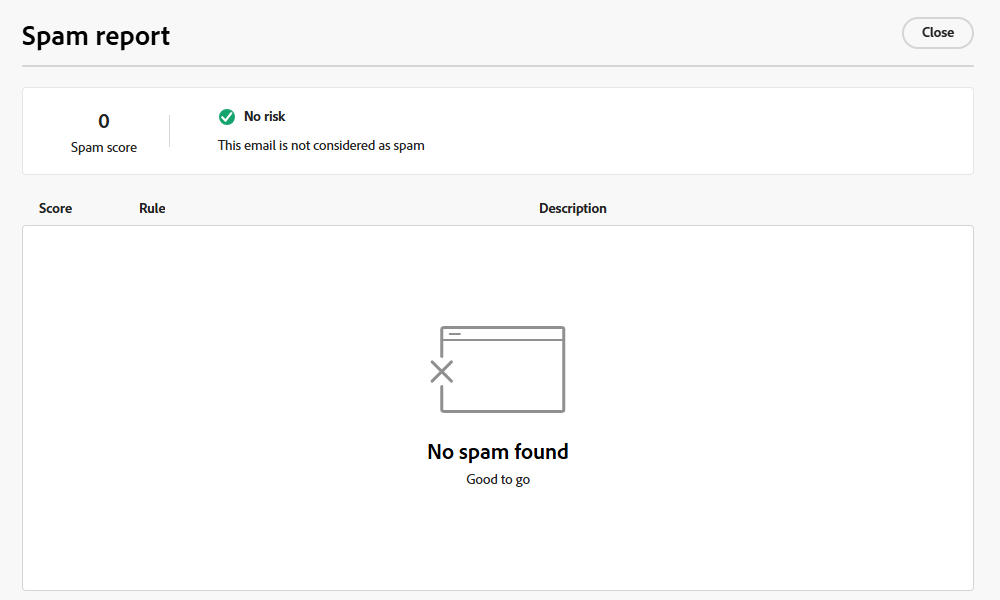

# 垃圾郵件報告 {#email-spam-report}

在Marketo Engage中使用SpamAssassin，您可以測試您的電子郵件內容，並檢視ISP/信箱提供者將其標示為垃圾郵件的可能性。

SpamAssassin會分析您的內容，並根據各種條件指派分數。 分數越低越好。請務必維持低分，因為傳送高分的電子郵件可能會對您的整體傳遞能力造成負面影響。

## 存取垃圾郵件報告 {#access-the-spam-report}

1. 在您的電子郵件中，按一下&#x200B;**模擬內容**。

   {width="600" zoomable="yes"}

   >[!NOTE]
   >
   >如果您尚未新增測試設定檔，您必須直接在步驟1之後新增。

1. 按一下&#x200B;**垃圾郵件報告**&#x200B;按鈕。

   

1. 產生垃圾郵件報告。

   {width="600" zoomable="yes"}

1. 檢查每個專案的分數和說明。

   >[!IMPORTANT]
   >
   >如果整體分數高於5，您的電子郵件可能會在傳送時遭到封鎖或標示為垃圾郵件。

1. 如果您認為分數太高，請根據報告的發現來編輯電子郵件Designer中的內容，然後重新執行&#x200B;**垃圾郵件報告**。

   {width="800" zoomable="yes"}

當分數符合您的喜好時，即可傳送。

{width="800" zoomable="yes"}

>[!NOTE]
>
>垃圾郵件分數透過SpamAssassin衍生，而規則不屬於Adobe。 有關這些規則的更多詳細資訊，請參閱[SpamAssassin檔案](https://spamassassin.apache.org/#_blank){target="_blank"}。 您可在此看到[錯誤的完整清單](https://spamassassin.apache.org/old/tests_3_0_x.html){target="_blank"}。
