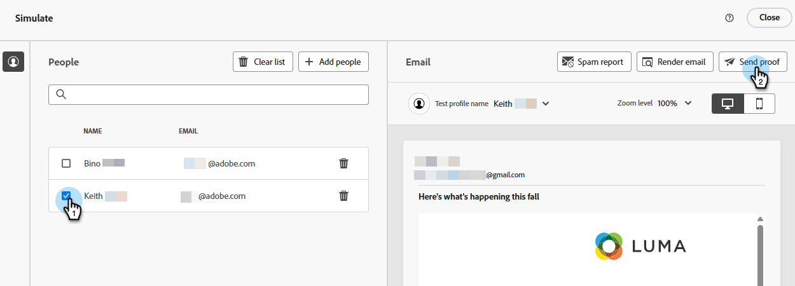

# 使用 Litmus 測試電子郵件呈現 {#test-email-rendering-with-litmus}

利用您在Marketo Engage中的[Litmus](https://www.litmus.com/email-testing)帳戶，立即檢視您的電子郵件在常見電子郵件使用者端中的呈現方式。

>[!AVAILABILITY]
>
>此功能適用於擁有有效Litmus帳戶的所有Marketo Engage使用者。

## Litmus Enterprise使用者 {#litmus-enterprise}

下列步驟適用於[Litmus企業計畫](https://www.litmus.com/pricing/enterprise){target="_blank"}的使用者。

1. 在&#x200B;_編輯電子郵件內容_&#x200B;畫面上，按一下&#x200B;**模擬內容**&#x200B;按鈕。

   

1. 選取您的測試收件者並按一下&#x200B;**轉譯電子郵件**&#x200B;按鈕。

   {width="800" zoomable="yes"}

1. 如果您尚未連線，請&#x200B;**連線您的Litmus帳戶**。 如果您已完成此步驟，請跳至步驟6。

   {width="800" zoomable="yes"}

1. 輸入您的Litmus認證，然後按一下&#x200B;**登入**。

   >[!IMPORTANT]
   >
   >將您的Litmus帳戶連線至Marketo Engage時，您同意將測試電子郵件傳送至Litmus。 傳送後，Adobe將不再管理這些測試電子郵件。 因此，Litmus資料保留電子郵件原則適用於這些電子郵件，包括可能包含在它們中的個人化資料。

1. 按一下&#x200B;**連線**&#x200B;以完成整合。

   

1. 按一下&#x200B;**執行測試**&#x200B;按鈕以產生電子郵件預覽。

1. 瞭解您的內容在熱門的桌上型電腦、行動裝置和網頁型電子郵件使用者端中的面貌。 按一下您要預覽的縮圖，數量不限。

   {width="800" zoomable="yes"}

   >[!NOTE]
   >
   >瞭解如何[自訂您的預設電子郵件使用者端清單](https://help.litmus.com/article/227-change-your-default-email-clients-list)。

1. 完成測試後，按一下左上方的向後箭頭，返回&#x200B;_模擬內容_&#x200B;畫面。

   

**選擇性步驟**：如果您決定變更您的電子郵件，在您按一下&#x200B;**轉譯電子郵件**&#x200B;進行檢視之後，請務必也按一下Litmus **電子郵件預覽**&#x200B;畫面右上角的&#x200B;_重新測試_&#x200B;按鈕。

## Litmus核心使用者 {#litmus-core}

下列步驟適用於[Litmus核心計畫](https://www.litmus.com/pricing/){target="_blank"}的使用者。

1. 在您的Litmus帳戶中，按一下&#x200B;**測試**&#x200B;畫面中的&#x200B;_複製測試地址_&#x200B;按鈕，擷取測試電子郵件地址。

   {width="800" zoomable="yes"}

1. 在Marketo Engage中，導覽至所需電子郵件的&#x200B;_編輯電子郵件內容_&#x200B;畫面，然後按一下&#x200B;**模擬內容**&#x200B;按鈕。

   {width="600" zoomable="yes"}

1. 選取測試收件者，然後按一下&#x200B;**傳送校樣**&#x200B;按鈕。

   {width="800" zoomable="yes"}

1. 輸入您在步驟1中複製的Litmus電子郵件地址，然後再次按一下&#x200B;**傳送校樣**。

   

1. 檢閱您Litmus帳戶內的電子郵件（位於與您從Litmus複製的電子郵件地址相對應的資料夾中）。

   {width="800" zoomable="yes"}
