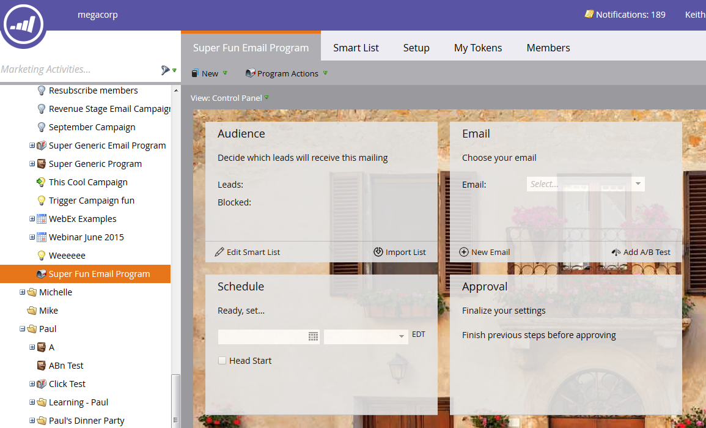

# 建立電子郵件方案 {#create-an-email-program}

使用電子郵件程式快速輕鬆地向一組人員發送電子郵件。

1. 前往 **行銷活動**.

   

1. 選擇要在中建立程式的資料夾，按一下 **新增** 下拉式清單，然後選取 **新計畫**.

   

1. 輸入名稱，選擇 **電子郵件** 作為方案類型，然後按一下 **建立**.

   

   >[!NOTE]
   >
   >選取 **電子郵件** 節目類型中，管道會自動設為 **電子郵件傳送**. 您可以視需要加以變更。

   

不錯！ 請注意，程式現在位於樹狀結構中，且已可供使用。 下一步是定義您的對象。 請參閱下方的Marketo相關文章。

>[!MORELIKETHIS]
>
>* [使用智慧清單定義對象](/help/marketo/product-docs/email-marketing/email-programs/managing-people-in-email-programs/define-an-audience-with-a-smart-list.md)
>* [匯入清單以定義對象](/help/marketo/product-docs/email-marketing/email-programs/managing-people-in-email-programs/define-an-audience-by-importing-a-list.md)

