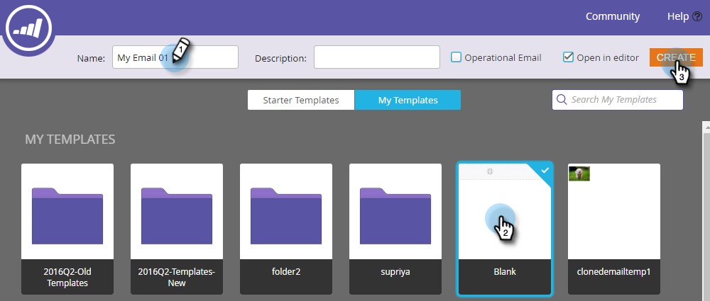
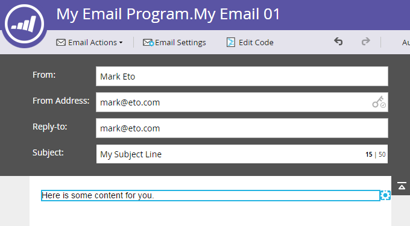

# 為電子郵件方案建立電子郵件 {#create-an-email-for-an-email-program}

>[!PREREQUISITES]
>
>* [建立電子郵件程式](/help/marketo/product-docs/email-marketing/email-programs/creating-an-email-program/create-an-email-program.md)
>* [使用智慧列示定義對象](/help/marketo/product-docs/email-marketing/email-programs/managing-people-in-email-programs/define-an-audience-with-a-smart-list.md)或[透過匯入清單定義對象](/help/marketo/product-docs/email-marketing/email-programs/managing-people-in-email-programs/define-an-audience-by-importing-a-list.md)

建立電子郵件方案並定義對象後，您會想要決定要傳送的電子郵件。 您可以[選擇現有的電子郵件](/help/marketo/product-docs/email-marketing/email-programs/email-program-actions/choose-an-existing-email.md)，或從頭開始建立電子郵件。 以下說明如何建立新電子郵件。

1. 前往 **[!UICONTROL Marketing Activities]**。

   

1. 選取您的電子郵件程式。 在&#x200B;**[!UICONTROL Email]**&#x200B;圖磚下，按一下&#x200B;**[!UICONTROL New Email]**。

   

1. 輸入&#x200B;**[!UICONTROL Name]**，選取您選擇的範本，然後按一下&#x200B;**[!UICONTROL Create]**。

   

1. 進行您想要的所有變更，並關閉編輯器。

   

   >[!NOTE]
   >
   >瞭解如何[編輯電子郵件中的元素](/help/marketo/product-docs/email-marketing/general/email-editor-2/edit-elements-in-an-email.md)。

1. 別忘了核准您的電子郵件。

   

太棒了！ 現在我們已建立要傳送的電子郵件，請[新增A/B測試](/help/marketo/product-docs/email-marketing/email-programs/email-program-actions/email-test-a-b-test/add-an-a-b-test.md)或直接跳到[排程您的電子郵件程式](/help/marketo/product-docs/email-marketing/email-programs/email-program-actions/schedule-your-email-program.md)。
