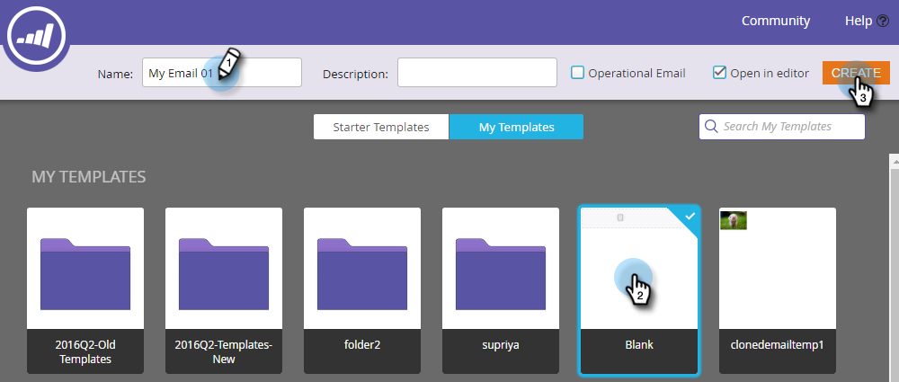

# 為電子郵件程式建立電子郵件{#create-an-email-for-an-email-program}

>[!PREREQUISITES]
>
>* [建立電子郵件方案](/help/marketo/product-docs/email-marketing/email-programs/creating-an-email-program/create-an-email-program.md)
>* [使用智慧型存取者定](/help/marketo/product-docs/email-marketing/email-programs/managing-people-in-email-programs/define-an-audience-with-a-smart-list.md) 義對 [像匯入清單定義對象](/help/marketo/product-docs/email-marketing/email-programs/managing-people-in-email-programs/define-an-audience-by-importing-a-list.md)

>

一旦您建立了電子郵件計畫並定義了受眾，您就會想決定要傳送的電子郵件。 您可以[選擇現有的電子郵件](choose-an-existing-email.md)，或從頭開始建立。 以下是如何建立新電子郵件。

1. 前往&#x200B;**行銷活動**。

   

1. 選擇您的電子郵件方案。 在&#x200B;**Email**&#x200B;表徵圖下，按一下&#x200B;**New Email**。

   

1. 輸入&#x200B;**名稱**，選擇您選擇的模板，然後按一下&#x200B;**建立**。

   

1. 進行您想要的所有變更，並關閉編輯器。

   

   >[!NOTE]
   >
   >瞭解如何[編輯電子郵件中的元素](/help/marketo/product-docs/email-marketing/general/email-editor-2/edit-elements-in-an-email.md)。

1. 別忘了核准您的電子郵件。

   

太好了！ 既然我們已建立要傳送的電子郵件，讓我們[加入A/B測試](email-test-a-b-test/add-an-a-b-test.md)或直接跳至[排程您的電子郵件程式](schedule-your-email-program.md)。

>[!MORELIKETHIS]
>
>* [新增A/B測試](email-test-a-b-test/add-an-a-b-test.md)
>* [排程您的電子郵件方案](schedule-your-email-program.md)

