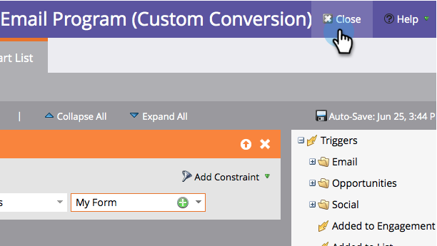

# 定義A/B測試獲勝者條件 {#define-the-a-b-test-winner-criteria}

時間 [新增A/B測試](/help/marketo/product-docs/email-marketing/email-programs/email-program-actions/email-test-a-b-test/add-an-a-b-test.md){target="_blank"} to your email program, you will need to pick a test type, [schedule the A/B test](/help/marketo/product-docs/email-marketing/email-programs/email-program-actions/email-test-a-b-test/schedule-the-a-b-test.md){target="_blank"}，然後定義獲勝者條件。 以下說明如何決定哪封電子郵件入選。

>[!PREREQUISITES]
>
>[新增A/B測試](/help/marketo/product-docs/email-marketing/email-programs/email-program-actions/email-test-a-b-test/add-an-a-b-test.md){target="_blank"}

## 獲勝者條件 {#winner-criteria}

1. 預設 **獲勝者條件** 選項會先列出。

   

   <table>
   <tr>
   <td><b>開啟數</b></td>
   <td>將影像下載到電子郵件中時，開啟的登入會進行。 即使不包含影像，根據預設，Marketo也會在所有HTML電子郵件中插入單一追蹤畫素。</td>
   </tr>
   <tr>
   <td><b>點擊次數</b></td>
   <td>依預設，電子郵件中的連結內嵌追蹤，可讓您檢視誰點按了哪個連結、點選連結總數等。</td>
   </tr>
   <tr>
   <td><b>按一下以開啟%</b></td>
   <td>已開啟且有連結在電子郵件中點按的電子郵件百分比。 這會測量電子郵件的相關性和內容，方法是使用不重複點按次數除以不重複開啟次數，然後乘以100以百分比顯示。</td>
   </tr>
   <tr>
   <td><b>參與分數</b></td>
   <td>此 <a href="https://experienceleague.adobe.com/docs/marketo/using/product-docs/email-marketing/drip-nurturing/reports-and-notifications/understanding-the-engagement-score.html" target="_blank">參與分數</a> 可協助您判斷內容是否有效。</td>
   </tr>
   </table>

   >[!TIP]
   >
   >如果您選擇參與分數，測試將需要執行至少24小時。 進一步瞭解 [瞭解參與分數](/help/marketo/product-docs/email-marketing/drip-nurturing/reports-and-notifications/understanding-the-engagement-score.md){target="_blank"}.

1. 您也可以選取「自訂轉換」並按一下「編輯」來自訂條件。

   

   >[!NOTE]
   >
   >自訂轉換可讓您使用觸發器和篩選器挑選任何事件作為轉換。

1. 視窗隨即開啟。 找出您選擇的觸發器，並將其拖曳至畫布中。

   

1. 定義觸發器。

   

   >[!IMPORTANT]
   >
   >Marketo僅允許從這個電子郵件程式傳送電子郵件之人員的觸發器/篩選器，因此不需要新增「已傳送電子郵件」篩選器。 此外，使用電子郵件相關的觸發器/篩選器時，請務必使用「is any」作為運運算元。

1. 按一下 **關閉**。

   

   太棒了！ 現在該決定如何決定獲勝者了。

## 宣告贏家 {#declare-winner}

1. 從兩個可用選項中選擇一個。

   

   >[!NOTE]
   >
   >如果您正在執行 **日期/時間** A/B測試，您只能選擇 **手動**.

   A/B測試完成後，Marketo可以在排程的時間自動傳送成功電子郵件，或者您可以檢閱結果並決定哪封電子郵件何時送出。

1. 「自動」很棒，而且是預設選項。 只需按一下 **下一個**.

   

   >[!TIP]
   >
   >選擇 **手動** 會傳送測試出去，並等待您宣告獲勝者。 您將會收到結果的報告。

完美！ 現在，讓 [排程A/B測試](/help/marketo/product-docs/email-marketing/email-programs/email-program-actions/email-test-a-b-test/schedule-the-a-b-test.md){target="_blank"}.
