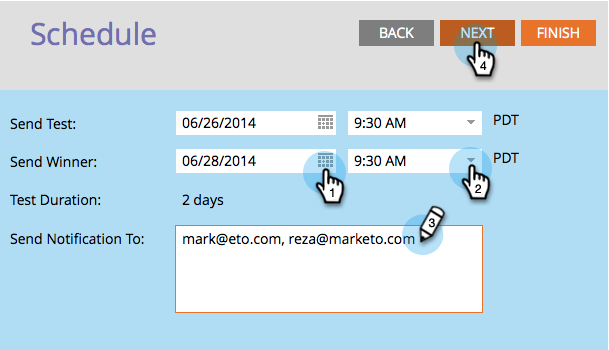

# 排程A/B測試 {#schedule-the-a-b-test}

在您將A/B測試新增至電子郵件程式並定義成功者標準後，您就需要在測試開始時排程。 這是方法。

>[!NOTE]
>
>**必要條件**
>
>* [新增A/B測試](add-an-a-b-test.md)

>

>[!NOTE]
>
>對於日期／時間測試，您只需在收到測試結果摘要時進行設定。

1. 選取「傳送測試日期」。

1. 選擇「 **傳送測試** 」時間。

   

   >[!NOTE]
   >
   >傳送測試和傳送成功者必須間隔至少4小時。 不過，對於較大的傳送，您可能需要等候24小時，以便有足夠的時間取得良好結果。

1. 對「傳送成功者」執 **行相同動作**。 輸入通知收件者（可選），然後按一下「 **下一步**」。

   >[!NOTE]
   >
   >**提醒**
   >
   >
   >只有測試群組會收到測試變數。

   

   >[!NOTE]
   >
   >如果您選擇手動宣告成功者，您將定義「報 **表傳送日期** /時間」，而非「 **** 完成郵寄日期／時間」。

   超級！ 您已完成，只要檢閱摘要，然後按一下「關閉」即可。
   

   您會注意到「排程 **」圖格** 現在已更新。

   

   >[!NOTE]
   >
   >排程A/B測試也會設定最終傳送日期或報表傳送日期。

   假設您已定義對象並選取電子郵件，則剩下的唯一步驟就是核准程式。

   >[!NOTE]
   >
   >**相關文章**
   >
   >    
   >    
   >    * [批准／取消批准電子郵件方案](../../../../../product-docs/email-marketing/email-programs/email-program-actions/approve-unapprove-an-email-program.md)

