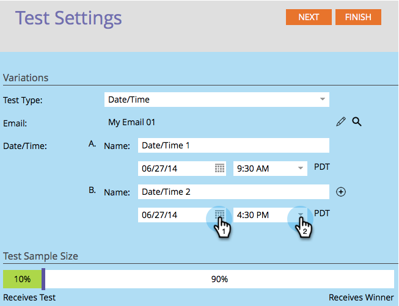
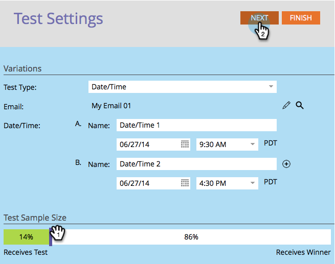

# 使用「日期/時間」A/B測試 {#use-date-time-a-b-testing}

您可以輕鬆對電子郵件進行A/B測試。 一項測試是 **日期/時間** 測試。 這會測試一天中的哪個時間或星期幾最適合傳送電子郵件。 以下說明設定方法。

>[!PREREQUISITES]
>
>[新增A/B測試](/help/marketo/product-docs/email-marketing/email-programs/email-program-actions/email-test-a-b-test/add-an-a-b-test.md)
>

1. 在 **電子郵件** 圖磚，按一下 **新增A/B測試**.

   

1. 新視窗隨即開啟。 選取 **日期/時間** 的 **測試型別**.

   

1. 如果您有先前的測試資訊（例如主旨測試），您可以安全地按一下 **重設測試**.

   

1. 選取您的第一個日期/時間的日期。

   

1. 選取您的第一個日期/時間的時間。

   

1. 針對您的第二個日期/時間執行相同操作。

   

1. 使用滑桿選取您要在A/B測試中選取的讀者百分比，然後按一下 **下一個**.

   

   >[!NOTE]
   >
   >不同的變化將套用至所選測試樣本大小的相等部分。

   >[!CAUTION]
   >
   >**建議您避免將樣本大小設為100%**. 如果您使用靜態清單，將範例大小設為100%會傳送電子郵件給對象中的每個人，而獲勝者不會獲得任何人。 如果您使用 **智慧** 清單，將樣本大小設為100%會傳送電子郵件給對象中的每個人 _屆時_. 稍後當電子郵件程式再次執行時，符合智慧清單資格的任何新使用者也將收到電子郵件，因為他們現在包含在受眾中。

   好的，我們更近一步。 現在我們需要 [定義A/B測試獲勝者條件](/help/marketo/product-docs/email-marketing/email-programs/email-program-actions/email-test-a-b-test/define-the-a-b-test-winner-criteria.md).
