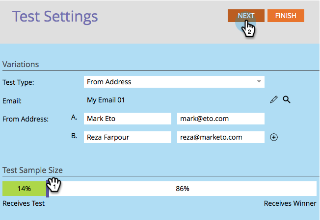

# 使用「寄件者地址」A/B測試 {#use-from-address-a-b-testing}

您可以輕鬆A/B測試您的電子郵件。 一個有趣的測試是 **寄件者地址** 測試。 下面是如何設定它。

>[!PREREQUISITES]
>
>[新增A/B測試](/help/marketo/product-docs/email-marketing/email-programs/email-program-actions/email-test-a-b-test/add-an-a-b-test.md)

1. 在 **電子郵件** 圖磚，在選取您的電子郵件後，按一下 **新增A/B測試**.

   

1. 新窗口開啟，選擇 **寄件者地址** for **測試類型**.

   

1. 如果您有先前的測試資訊（如主題測試），您可以安全地按一下 **重置測試**.

   

1. 輸入第二個 **寄件者地址** 要測試的資訊。

   >[!NOTE]
   >
   >選擇A會預先填入所選電子郵件中包含的資訊。

   

   >[!TIP]
   >
   >您可以按一下 **+** 添加任意數量的「寄件地址」。

1. 使用滑桿來選擇您要在A/B測試中佔受眾的百分比，然後按一下 **下一個**.

   

   >[!NOTE]
   >
   >不同的變數會傳送至所選測試樣本大小的相等部分。

   >[!CAUTION]
   >
   >**建議您避免將樣本大小設為100%**. 如果您使用靜態清單，將樣本大小設為100%會傳送電子郵件給對象中的所有人，而獲勝者不會收到任何人。 如果您使用 **智慧** 清單中，將樣本大小設為100%會傳送電子郵件給對象中的所有人 _當時_. 當電子郵件程式在稍後日期再次執行時，符合智慧清單資格的任何新人員也會收到電子郵件，因為他們現在已包含在對象中。

   好，我們快到了。 現在我們需要 [定義A/B測試獲勝者條件](/help/marketo/product-docs/email-marketing/email-programs/email-program-actions/email-test-a-b-test/define-the-a-b-test-winner-criteria.md).
