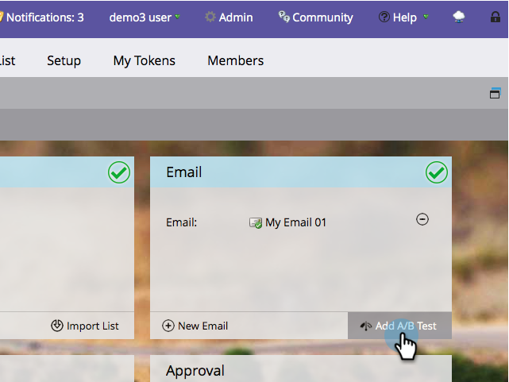

# 使用「整封電子郵件」A/B測試 {#use-whole-email-a-b-testing}

您可以輕鬆A/B測試您的電子郵件。 一個偉大的考驗是 **完整電子郵件** 測試。 下面是如何設定它。

>[!PREREQUISITES]
>
>[新增A/B測試](/help/marketo/product-docs/email-marketing/email-programs/email-program-actions/email-test-a-b-test/add-an-a-b-test.md)

1. 在「電子郵件」方塊下，選取您的電子郵件後，按一下 **新增A/B測試**.

1. 新視窗隨即開啟。 按一下 **測試類型** 下拉式清單並選取 **完整電子郵件**.

   

1. 如果您有先前的測試資訊（如主題測試），您可以安全地按一下 **重置測試**.

   

1. 選取您的第一封電子郵件。

   

1. 按一下 **新增** 來套用電子郵件。

   

   >[!TIP]
   >
   >您可以新增多封電子郵件。 不過，如果新增太多，可能會拖慢測試程式的速度。

1. 選取您的第二封電子郵件。

   

1. 按一下 **新增** 來套用第二封電子郵件。 拖曳滑桿以選擇您要接收A/B測試的對象百分比，然後按一下 **下一個**.

   

   >[!NOTE]
   >
   >不同的變數會傳送至所選取的相等部分 **測試樣本大小**.

   >[!CAUTION]
   >
   >**建議您避免將樣本大小設為100%**. 如果您使用靜態清單，將樣本大小設為100%會傳送電子郵件給對象中的所有人，而獲勝者不會收到任何人。 如果您使用 **智慧** 清單中，將樣本大小設為100%會傳送電子郵件給對象中的所有人 _當時_. 當電子郵件程式在稍後日期再次執行時，符合智慧清單資格的任何新人員也會收到電子郵件，因為他們現在已包含在對象中。

   好，我們快到了。 現在我們需要 [定義A/B測試獲勝者條件](/help/marketo/product-docs/email-marketing/email-programs/email-program-actions/email-test-a-b-test/define-the-a-b-test-winner-criteria.md).
