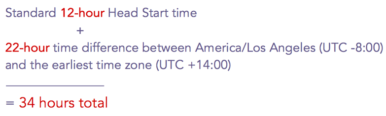

# 電子郵件計畫的開端 {#head-start-for-email-programs}

>[!PREREQUISITES]
>
>[建立電子郵件程式](/help/marketo/product-docs/email-marketing/email-programs/creating-an-email-program/create-an-email-program.md)

當您選擇電子郵件程式的日期/時間時，它會決定程式開始處理的時間。 如果您希望電子郵件在選取的時間啟動，「開頭開始」會提供您預先處理程式的選項。

## 標準開端 {#standard-head-start}

1. 按一下 **行銷活動**.

   

1. 尋找並選取您的電子郵件程式。

   

   >[!NOTE]
   >
   >Head Start不可用於A/B測試。

1. 在「排程」圖磚中，排程您的電子郵件，然後選取 **開端** 方塊。

   

   選取「開始時間」後，程式將在排程時間前約12小時開始處理。 處理開始後，程式就會鎖定。

   >[!CAUTION]
   >
   >在方案鎖定後取消訂閱的受眾的任何人仍會收到電子郵件。 建議您調整取消訂閱通知，以反映取消訂閱可能需要1-2個工作日才能處理。

1. 按一下 **核准方案**.

   

   方案核准後，您會在「核准」方塊上看到四種不同的狀態。

   * **正在等候執行：** 在方案核准後。
   * **處理已開始，正在等候執行：** 處理進行中。
   * **處理完成，等待執行：** 處理完成，電子郵件現在正等待排程的時間啟動。
   * **已完成：** 程式已完成。

   >[!TIP]
   >
   >想要在程式鎖定之後但在電子郵件傳送之前取消？ 沒問題！ 只需按一下 **中止程式** 在「核准」圖磚的右下方。

   >[!NOTE]
   >
   >如果您在電子郵件程式排定的執行時間之前不到12小時就取消核准該程式，但後來改變心意，您將需要選擇至少比核準時提前12小時的新日期/時間。

## 以收件者時區開頭的 {#head-start-with-recipient-time-zone}

我們現有的「開門即用」功能要求程式至少提前12小時排程。 這對收件者時區有何意義？ 回想一下，當收件者時區作用中時，我們會在最早時區的午夜開始執行電子郵件程式(UTC +14:00)。 因此，若要啟用 **兩者** 開頭和收件者時區，需要排程程程式 **至少比最早時區提前12小時(UTC +14:00**.)

這代表如果您位於美洲/洛杉磯，且想要同時啟用開始時間和收件者時區，則需排程方案 **34小時** 事前準備。 我們如何取得這個數字？

[瞭解更多](/help/marketo/product-docs/email-marketing/email-programs/email-program-actions/scheduling-with-recipient-time-zone/schedule-email-programs-with-recipient-time-zone.md) 有關如何使用收件者時區排程電子郵件程式的資訊。

>[!MORELIKETHIS]
>
>* [排程您的電子郵件程式](/help/marketo/product-docs/email-marketing/email-programs/email-program-actions/schedule-your-email-program.md)
>* [使用收件者時區排程電子郵件程式](/help/marketo/product-docs/email-marketing/email-programs/email-program-actions/scheduling-with-recipient-time-zone/schedule-email-programs-with-recipient-time-zone.md)
>* [瞭解收件者時區](/help/marketo/product-docs/email-marketing/email-programs/email-program-actions/scheduling-with-recipient-time-zone/understanding-recipient-time-zone.md)
