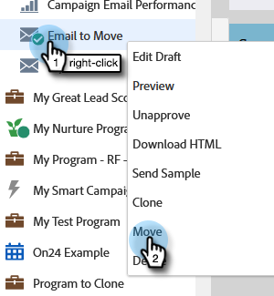

# 移動電子郵件 {#move-an-email}

需要將電子郵件從一個程式移至另一個程式嗎？ 這是方法。

1. 前往 **行銷活動**.

   

1. 找到您要移動的電子郵件，按一下右鍵並選取 **移動**.

   

1. 選取 **目的地**, **方案**，選填 **資料夾**. 選擇 **移動**.

   

   >[!NOTE]
   >
   >在此範例中，我們會將電子郵件移至其他程式，但您也可以將電子郵件移至Design Studio中的資料夾。

   你將看到你的電子郵件現在在另一個程式中。

   

   >[!NOTE]
   >
   >您也可以將電子郵件拖放至樹狀結構內的新目的地。
