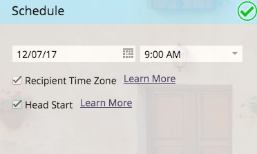

# 排程您的電子郵件方案 {#schedule-your-email-program}

>[!PREREQUISITES]
>
>* [建立電子郵件方案](/help/marketo/product-docs/email-marketing/email-programs/creating-an-email-program/create-an-email-program.md)
>* [使用智慧清單定義對象](/help/marketo/product-docs/email-marketing/email-programs/managing-people-in-email-programs/define-an-audience-with-a-smart-list.md) 或 [匯入清單以定義對象](/help/marketo/product-docs/email-marketing/email-programs/managing-people-in-email-programs/define-an-audience-by-importing-a-list.md)
>
>* [選擇現有電子郵件](/help/marketo/product-docs/email-marketing/email-programs/email-program-actions/choose-an-existing-email.md) 或 [為電子郵件方案建立電子郵件](/help/marketo/product-docs/email-marketing/email-programs/email-program-actions/create-an-email-for-an-email-program.md)

在建立電子郵件方案、定義對象並選取電子郵件後，您會想告訴方案 *when* 以傳送電子郵件。 這是方法。

1. 前往 **行銷活動**.

   

1. 選取您的電子郵件方案。

   

1. 在 **排程** 平鋪，設定日期。

   

1. 然後是時間。

   

1. 您也可以選擇使用 [收件者時區](/help/marketo/product-docs/email-marketing/email-programs/email-program-actions/scheduling-with-recipient-time-zone/schedule-email-programs-with-recipient-time-zone.md) 和/或 [開始](/help/marketo/product-docs/email-marketing/email-programs/email-program-actions/head-start-for-email-programs.md) 功能。

   

   那有多容易？ 剩下的只是 [核准電子郵件方案](/help/marketo/product-docs/email-marketing/email-programs/email-program-actions/approve-unapprove-an-email-program.md) 你也該走了。

>[!MORELIKETHIS]
>
>* [使用收件者時區排程電子郵件方案](/help/marketo/product-docs/email-marketing/email-programs/email-program-actions/scheduling-with-recipient-time-zone/schedule-email-programs-with-recipient-time-zone.md)
>* [電子郵件計畫搶灘](/help/marketo/product-docs/email-marketing/email-programs/email-program-actions/head-start-for-email-programs.md)

