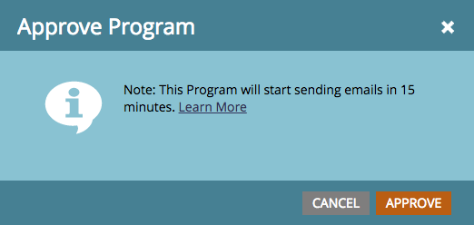

# 計畫包含收件者時區的電子郵件程式 {#schedule-email-programs-with-recipient-time-zone}

在啟用「收件者時區」時，排程電子郵件程式時有兩種可能的情形：

1. 將程式安排在 **** 25小時內運行
1. 將程式排程 **在** 25小時以上（即下週）

## 方案1:25小時內 {#scenario-within-hours}

假設您核准啟用「收件者時區」且排程在25小時內傳送的電子郵件方案。 您的智慧型清單中可能會有人居住在已排程時間過去的時區。

在此案例中，我們允許您決定如何處理這些合格人員子集。 在電子郵件程式的「排程 **」方塊中，按一下「收件者時區** 」旁 **** 邊的齒輪圖示。

這提供了兩個選項：

>[!NOTE]
>
>**定義**
>
>* **在收件者的時區提供下一天**:如果電子郵件排定在星期二上午9:00外出，在排定時間已過的時區居住的合格人員，將於週三上午9:00收到 *電* 子郵件。
   >
   >
* **使用程式的預設設定時間提供**:如果電子郵件排程在星期二上午9:00外出，則居住在已排程時間經過的時區的合格人員，會根據您的訂閱時區設定 *收到電子郵件*。 因此，如果您 [的訂](../../../../../product-docs/administration/settings/select-your-language-locale-and-time-zone.md) 閱時區設定設為PDT America/Los Angeles  ，這些收件者仍會在星期二上午9:00（不論其時區內的時間為何）收到電子郵件。

>

>[!NOTE]
>
>[進一步瞭解](https://docs.marketo.com/display/DOCS/Understanding+Recipient+Time+Zone#UnderstandingRecipientTimeZone-CalculatingTimeZone) Marketo如何為收件者計算時區。

讓我們更詳細地考慮這種情況。 假設您在舊金山，早上7:00排程電子郵件，以 **接收9:00** 。 在您的智慧清單中，有來自下列地區的人員：

* 舊金山
* 德克薩斯州
* 紐約
* 義大利

上午9:00已經在紐約和義大利過去，因此這兩個時區的合格人員將會根據「時區設定」收 **到電子郵件**:

* **在收件者的時區提供下一天：** 週三上午9點，在各自的時區， **OR**

* **使用程式的預設設定時間提供**:星期二上午9:00美元（紐約東部夏令時間下午12:00，義大利東部時間下午6:00）。

一旦您核准程式後，該程式會在15分鐘內開始執行。

>[!NOTE]
>
>雖然本計畫將在 *15分鐘內* ，開始傳送電子郵件的程式，但當時 *不會傳* 送電子郵件。 收件者仍會根據您選擇的時 **區設定收到電子郵件** 。

## 方案2:超過25小時 {#scenario-more-than-hours}

在第二種情況下，您會核准啟用「收件者時區 **** 」且排程的傳送時間超過25小時的電子郵件方案。 在這種情況下，該程式將在世界上最早的時 **區** (UTC + 14:00)按預定時間開始運行。 全球每個時區都有符合您智慧型清單資格的人員，因此從最早的時區開始，我們可以在排程的日期／時間將電子郵件傳送給其各自時區的所有收件者。

開始前行

現在，讓我們討論一下Head [Start如何與](../../../../../product-docs/email-marketing/email-programs/email-program-actions/head-start-for-email-programs.md)**收件者時區搭配運作**。 我們現有的Head Start功能要求計畫至少提前12小時完成。 那麼，這對收件者時區意味著什麼？ 請記住，啟用「收件者時區」後，我們會在最早時區(UTC +14:00)的排程時間開始執行電子郵件程式。 因此，要同時啟 **用** Head Start和Recipient Time Zone **，電子郵件程式必須至少提前12小時以UTC +14:00排定。**

這表示，如果您在美國／洛杉磯，而且想要同時啟用「開始前端」和「收件者時區」，您必須提前 **** 34小時排程計畫。 我們怎麼得到這個號碼的？

  

簡而言之，使用「收件者時區」排程的電子郵件程式必須在排程的時間開始在最早的時區（亦即最早到達午夜的時區）執行，以便適應每個時區。 所以，如果您排程電子郵件程式……

* **在25小時內 *完成***，程式將在15分鐘內開始執行。 已超過排程時間的收件者，將會根據您選擇的時區設定收到電子郵件。
* **未來的發 *送時間**超過* 25小時**，程式會在最早時區的排程時間開始執行(UTC +14:00)。
* **使用Head Start**，該程式在最早時區的預定時間前12小時開始處理(UTC +14:00)。

>[!CAUTION]
>
>在您開始傳送電子郵件至實際傳送電子郵件之間取消訂閱的人，仍會收到電子郵件。 我們建議您調整取消訂閱通知，以反映取消訂閱可能需要1-2個工作天才能處理。

>[!NOTE]
>
>**相關文章**
>
>* [瞭解收件者時區](understanding-recipient-time-zone.md)
>* [電子郵件計畫快速入門](../../../../../product-docs/email-marketing/email-programs/email-program-actions/head-start-for-email-programs.md)
>* [中止傳送以收件者時區排程的電子郵件程式](abort-delivery-of-email-programs-scheduled-with-recipient-time-zone.md)

>

