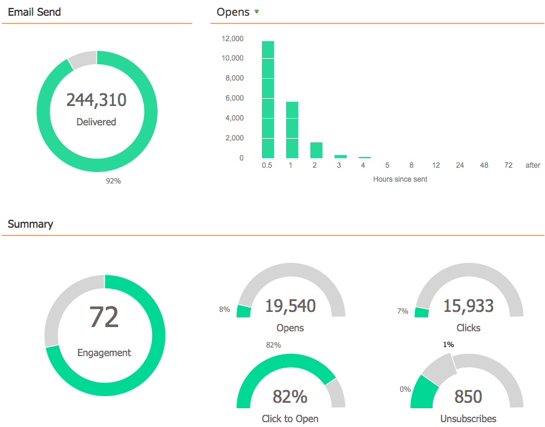

# 使用電子郵件計畫儀表板 {#use-the-email-program-dashboard}

透過此控制面板檢 [視](http://docs.marketo.com/display/docs/email+programs) ，瞭解您的電子郵件程式的執行狀況。

>[!NOTE]
>
>如果您的程式有A/B測試，請參閱「 [Email Program Dashboard - A/B測試檢視」](../../../../product-docs/email-marketing/email-programs/email-program-actions/email-test-a-b-test/use-the-email-program-dashboard-a-b-test-view.md)。

>[!NOTE]
>
>此檢視中的所有資料都會匯總（包括A/B測試以及最終電子郵件傳送）。

## 電子郵件傳送 {#email-send}

您可以在這裡看到有多少封電子郵件已傳送、遭拒和傳送。

>[!NOTE]
>
>由於電子郵件傳遞能力標準不受行銷人員控制，因此Roburced和Delivered統計資料是近似的，不是精確的。

## 開啟／點按 {#opens-clicks}

此圖表顯示在電子郵件程式執行後的特定時段內開啟／點按的電子郵件數。

>[!TIP]
>
>注意開啟／點按次數會隨著時間而減少。

## 摘要——參與 {#summary-engagement}

這會顯示整體參 [與分數](../../../../product-docs/email-marketing/drip-nurturing/reports-and-notifications/understanding-the-engagement-score.md)。

## 摘要——剩餘 {#summary-rest}

其餘資料會顯示「開啟」、「點按」、「點按／開啟比率」和「取消訂閱」。

>[!TIP]
>
>上 **述範例中的取消訂閱** (Unsubscribe)率太小，Market會放大顯示，以提供您更好的外觀。 條中的第二個數字僅添加為比例。

>[!NOTE]
>
>**定義**
>
>**開啟**會在電子郵件收件者下載電子郵件影像時計算，其中包含行銷人員插入的追蹤像素。 如果收件者檢視電子郵件，但選擇不下載其影像，則不會計為開啟。 如果影像載入收件者的預覽窗格中，通常會計為開啟，但會因電子郵件用戶端而異。
>
>**按一下「開啟** 」會測量已開啟且已在電子郵件中點按連結的電子郵件百分比。 我們會使用獨特點按次數除以獨特開啟次數，再乘以100以百分比顯示。

## 重新整理控制面板 {#refresh-dashboard}

若要查看最新資料，只需按一下控制面板上的重新整理圖示。

>[!MORELIKETHIS]
>
>* [使用電子郵件計畫儀表板- A/B測試視圖](../../../../product-docs/email-marketing/email-programs/email-program-actions/email-test-a-b-test/use-the-email-program-dashboard-a-b-test-view.md)

>

