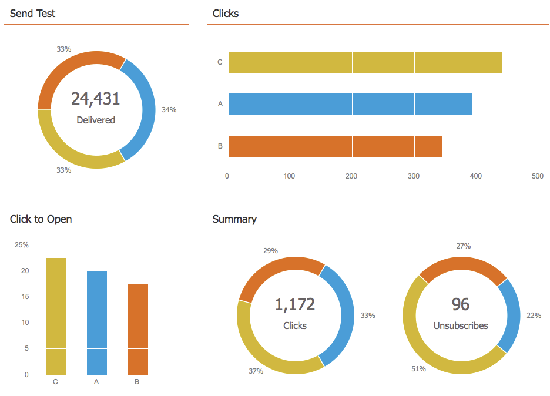

# 檢視電子郵件計畫控制面板 {#view-the-email-program-dashboard}

檢視您的電子郵件計畫（無論有無A/B測試）如何使用此儀表板執行。

## 選取您的電子郵件程式 {#select-your-email-program}

1. 前往 **行銷活動**.

   

1. 尋找並選取您的電子郵件程式。

   

   >[!CAUTION]
   >
   >如果您的A/B測試或電子郵件程式尚未開始，您不會看到控制面板。

## 電子郵件程式A/B測試檢視 {#email-program-a-b-test-view}

如果您將A/B測試新增至您的電子郵件程式，且測試目前正在執行中，您將會看到下列內容：

## 電子郵件程式檢視 {#email-program-view}

或者，如果您未新增A/B測試 *或* 如果測試結束，應顯示以下內容：

>[!TIP]
>
>將游標暫留在圖表Widget上以進行實驗。 它會顯示其他資訊。

>[!MORELIKETHIS]
>
>* [使用電子郵件計畫控制面板 — A/B測試檢視](/help/marketo/product-docs/email-marketing/email-programs/email-program-actions/email-test-a-b-test/use-the-email-program-dashboard-a-b-test-view.md)
>* [使用電子郵件程式控制面板](/help/marketo/product-docs/email-marketing/email-programs/email-program-data/use-the-email-program-dashboard.md)
