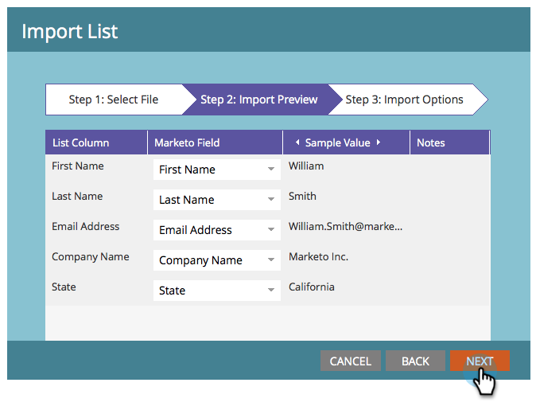

# 匯入清單以定義對象 {#define-an-audience-by-importing-a-list}

>[!PREREQUISITES]
>
>[為電子郵件方案建立電子郵件](/help/marketo/product-docs/email-marketing/email-programs/email-program-actions/create-an-email-for-an-email-program.md)

建立電子郵件方案後，您會想要告訴該方案要將電子郵件傳送至誰。 您可以透過 [建立智慧清單](/help/marketo/product-docs/core-marketo-concepts/smart-lists-and-static-lists/creating-a-smart-list/create-a-smart-list.md) 或匯入清單。 以下說明如何匯入清單來完成此作業。

>[!NOTE]
>
>只有在未核准電子郵件方案時，才能定義您的對象。
>
>匯入的任何日期/時間欄位都會視為中央時間。 如果您的日期/時間欄位位位於不同時區，則可使用Excel公式將其轉換為中央時間（美國/芝加哥）。

1. 前往 **行銷活動**.

   

1. 選取您的電子郵件方案，然後按一下「對象」方塊下的「匯入清單」 。

   

1. 開啟清單匯入視窗，按一下 **瀏覽** 並選擇要導入的檔案。 選取人員清單後，按一下 **下一個**.

   

   >[!CAUTION]
   >
   >請確定清單的編碼為UTF-8、UTF-16、Shift-JIS或EUC-JP，且檔案大小不超過50MB。

1. 確認檔案中的欄位已正確對應，然後按一下 **下一個**.

   

   >[!TIP]
   >
   >Marketo會記住未來匯入的對應！

1. 輸入 **名稱** 按一下 **匯入**.

   

1. 完成匯入後，返回主程式標籤。 你會看到有多少人有資格。

   

>[!NOTE]
>
>**定義**
>
>你注意到被阻止的號碼了嗎？ 此數字是合格人員的子集，代表無法傳送此電子郵件的人員，因為他們：
>
>* 退訂
>* 行銷活動已暫停
>* 已列入封鎖名單
>* 電子郵件無效
>* 空白電子郵件
>
>按一下號碼可以查看郵件阻止的詳細清單。
>
>使用  按鈕 **對象** 並排顯示，以根據智慧清單條件查看有資格接收電子郵件的人數。 從「人物」號碼中減去「已阻止」號碼，即可獲得將接收電子郵件的總人數。

>[!TIP]
>
>您不必等待清單匯入完成。 如果你願意，你可以繼續工作。

太棒了！ 現在，您可以選擇現有的電子郵件，或建立新電子郵件以傳送給這些人。

>[!MORELIKETHIS]
>
>* [選擇現有電子郵件](/help/marketo/product-docs/email-marketing/email-programs/email-program-actions/choose-an-existing-email.md)
>* [為電子郵件方案建立電子郵件](/help/marketo/product-docs/email-marketing/email-programs/email-program-actions/create-an-email-for-an-email-program.md)

