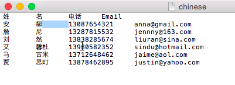

# 導入非拉丁字元清單 {#import-a-non-latin-characters-list}

嘗試匯入非英文的檔案？ 當您使用Excel開啟清單時，清單看起來非常完美。

但當您將其匯入Marketo時，您可能會發現非英文字元無法正確擷取。

這是因為檔案未正確儲存，以便Marketo識別所有非拉丁字元。 好消息是，您可以遵循一些簡單步驟來修復它。

1. 選擇 **另存新檔……** 從 **檔案** 功能表。

   

1. 選擇 **UTF-16 Unicode文本(.txt)** 作為 **格式** 選項。 這會以Marketo顯示檔案的方式來編碼檔案。

   

   >[!NOTE]
   >
   >Marketo也支援UTF-8、Shift-JIS或EUC-JP。

1. Excel會將新檔案儲存為副檔名為.txt的文字檔。 但它也會將檔案中的所有逗號轉換為索引標籤。 我們要把它改回來。

   >[!TIP]
   >
   >您可以使用 **記事本** 如果您使用Windows或 **文本編輯** 如果您使用Mac。

   

1. 從文檔中選擇一個頁簽並複製它。

   

1. 選擇 **查找和替換……** 從 **編輯** 功能表。

   

   >[!TIP]
   >
   >對Windows用戶的等效操作是： **編輯>替換……**

1. 將您在步驟4中複製的索引標籤貼到第一個（要取代）方塊，然後在第二個（取代為）方塊中輸入逗號。 然後按一下 **全部**.

   

1. 好了，所有的逗號都回來了，我們準備好了。

   

1. 將新檔案匯入Marketo，這次應該能正確顯示資訊。

   

   >[!NOTE]
   >
   >匯入的任何日期/時間欄位都會視為中央時間。 如果您的日期/時間欄位位位於不同時區，則可使用Excel公式將其轉換為中央時間（美國/芝加哥）。

我們知道這很奇怪，但它有用。 快樂的進口！
