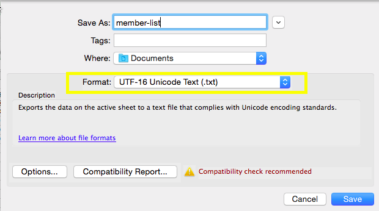

# 匯入非拉丁字元清單{#import-a-non-latin-characters-list}

嘗試匯入非英文的檔案？ 當您使用Excel開啟清單時，清單看起來就完美無缺。

但當您將它匯入Marketo時，可能會發現非英文字元無法正確擷取。

這是因為檔案無法正確儲存，Market無法識別所有非拉丁字元。 好消息是，您可以採取一些簡單步驟來修正它。

1. 選擇&#x200B;**另存新檔……**&#x200B;從Excel的&#x200B;**File**&#x200B;功能表。

   

1. 選擇&#x200B;**UTF-16 Unicode文本(.txt)**&#x200B;作為&#x200B;**格式**&#x200B;選項。 這會以Marketto顯示檔案的方式來編碼檔案。

   

   >[!NOTE]
   >
   >Marketo也支援UTF-8、Shift-JIS或EUC-JP。

1. Excel會將新檔案儲存為副檔名為。txt的文字檔案。 但它也會將檔案中的所有逗號轉換為標籤。 我們得把它改回去。

   >[!TIP]
   >
   >如果您使用Windows或&#x200B;**TextEdit**&#x200B;使用Mac，則可以使用&#x200B;**Notepad**&#x200B;開啟文字檔。

   

1. 從文檔中選擇一個頁籤並複製它。

   

1. 選擇&#x200B;**查找和替換……**&#x200B;編輯&#x200B;**選單中的**。

   

   >[!TIP]
   >
   >對Windows用戶的等效操作是：**編輯>取代……**

1. 將您在步驟4中複製的標籤貼入第一個（要取代）方塊，然後在第二個（取代為）方塊中輸入逗號。 然後按一下&#x200B;**All**。

   

1. 好了，所有逗號都回來了，我們準備開始了。

   

1. 將新檔案匯入Marketto，這次資訊應該會正確顯示。

   

   >[!NOTE]
   >
   >匯入的任何日期／時間欄位都會視為「中央時間」。 如果您在不同時區有日期／時間欄位，則可使用Excel公式將其轉換為中時（美國／芝加哥）。

我們知道這很奇怪，但是很管用。 快樂的進口！