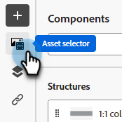

# 臨時檔案 {#temp-doc}

## 複製此部分下方 {#copy}

### 新增Assets {#add-assets}

新增儲存在Marketo Engage執行個體的[影像和檔案](/help/marketo/product-docs/demand-generation/images-and-files/add-images-and-files-to-marketo.md){target="_blank"}區段中的影像。

>[!NOTE]
>
>您目前只能在新設計工具中新增影像，不能新增其他檔案型別。

1. 若要存取影像，請按一下資產選擇器圖示。

   

1. 將所需的影像拖放至結構元件中。

   熒幕擷圖

   >[!NOTE]
   >
   >若要取代現有的影像，請選取該影像，然後在右側的[設定]索引標籤中按一下&#x200B;**選取資產**。

按一下「啟用條件內容」以新增動態內容，並根據條件規則將內容調整至目標設定檔。

如有需要，您可以按一下進階功能表中的「切換至程式碼編輯器」，進一步個人化您的電子郵件。 這可讓您編輯電子郵件原始碼，例如新增追蹤或自訂HTML標籤。

注意
切換到程式碼編輯器後，您無法返回此電子郵件的視覺化設計工具。

內容準備就緒後，按一下「模擬內容」按鈕以檢查呈現。 您可以選擇案頭或行動檢視。

準備就緒後，按一下儲存
