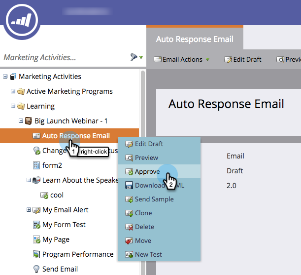

# 核准電子郵件 {#approve-an-email}

電子郵件開始處於草稿狀態。 在您核准它們之前，它們通常無法在系統中使用。 核准電子郵件有幾種方式。

## 使用電子郵件動作功能表核准 {#approve-it-using-the-email-actions-menu}

1. 尋找並選取您的電子郵件，按一下 **電子郵件動作** 下拉式清單並選取 **核准**.

   

## 直接在樹狀結構中核准 {#approve-it-directly-in-the-tree}

1. 尋找並選取您的電子郵件，以滑鼠右鍵按一下並選取 **核准**.

   

## 在電子郵件編輯器中核准您的電子郵件 {#approve-your-email-in-the-email-editor}

1. 在您的電子郵件中，按一下 **電子郵件動作** 下拉式清單並選取 **核准並關閉**.

   

核准後，您的電子郵件即可供使用！
