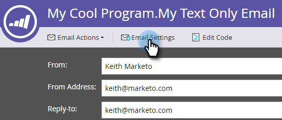

# 建立僅限文字的電子郵件 {#create-a-text-only-email}

如果您想要只傳送文字電子郵件，以下說明如何建立不含HTML內容的電子郵件。

>[!NOTE]
>
>由於開啟是由下載電子郵件影像的收件者追蹤（其中包含不可見的追蹤像素），因此無法 **追蹤** 「僅文字」電子郵件的開啟。

1. 前往「行銷 **活動** 」區。

   

1. 選擇您的方案，按一下「 **New** 」下拉式清單，然後選 **取「New Local Asset**」。

   

1. 選擇 **電子郵件**。

   

1. 輸入名 **稱**，選擇模板，然後按一下 **建立**。

   

1. 在電子郵件編輯器中，按一下「電 **子郵件設定」**。

   

1. 勾選「 **僅文字** 」並按一 **下「儲存**」。

   

   >[!CAUTION]
   >
   >不會在僅限文字的電子郵件中自動追蹤連結。 瞭解如何將追 [蹤的連結新增至文字電子郵件](../../../../product-docs/email-marketing/general/functions-in-the-editor/add-tracked-links-to-a-text-email.md)。

   >[!TIP]
   >
   >您也可以編輯現有的電子郵件並變更此設定。 別忘了核准草稿。

1. 取消選中「 **自動從HTML複製** 」複選框。

   

   >[!NOTE]
   >
   >任何新增至電子郵件HTML區段的內容，在傳送時都會被忽略。

1. 連按兩下文字區域。

   

1. 編輯文字，然後按一下「 **儲存**」。

   

就這麼簡單。
