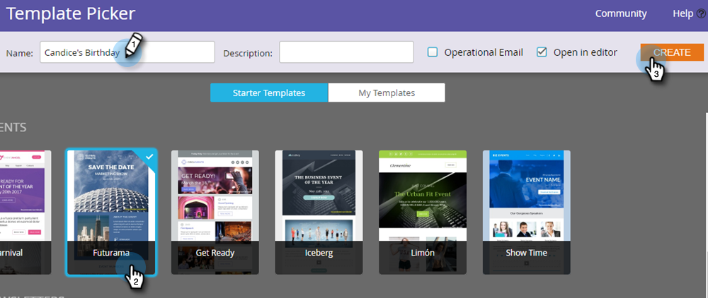

# 建立電子郵件 {#create-an-email}

在Marketo中建立電子郵件有兩種主要方式。 讓我們看兩者。

## 在Design Studio中建立電子郵件 {#create-an-email-in-the-design-studio}

1. 前往 **Design Studio**.

   

1. 按一下 **新增** 下拉式清單並選取 **新電子郵件**.

   

   >[!NOTE]
   >
   >在Design Studio中建立電子郵件時，可在樹狀結構的「電子郵件」下找到。

簡單！ 換句話說……

## 在行銷活動中建立電子郵件 {#create-an-email-in-marketing-activities}

1. 前往 **行銷活動**.

   

1. 選取您要新增電子郵件的方案，按一下 **新增** 下拉式清單並選取 **新本機資產**.

   

1. 按一下 **電子郵件**.

   

   就這樣！

選擇的任何方法都會將您導向範本選擇器。

1. 為您的電子郵件命名，按一下您要使用的範本，然後按一下 **建立**.

   

   >[!NOTE]
   >
   >您可以選擇準備就緒的回應式電子郵件範本集合，或您先選取以儲存的範本 **我的範本**，並遵循相同步驟。

1. 輸入主旨行。 建議的字元限制為50。

   

   根據您選擇的範本，您會有不同的選項可編輯電子郵件。 若是包含模組的電子郵件，請簽出 [新增模組至您的電子郵件](/help/marketo/product-docs/email-marketing/general/email-editor-2/add-modules-to-your-email.md).

您的電子郵件現在已建立，請立即編輯！

>[!MORELIKETHIS]
>
>[編輯您的電子郵件標題](/help/marketo/product-docs/email-marketing/general/creating-an-email/edit-your-email-header.md)
