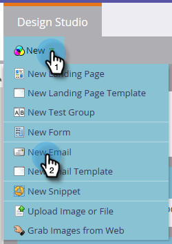
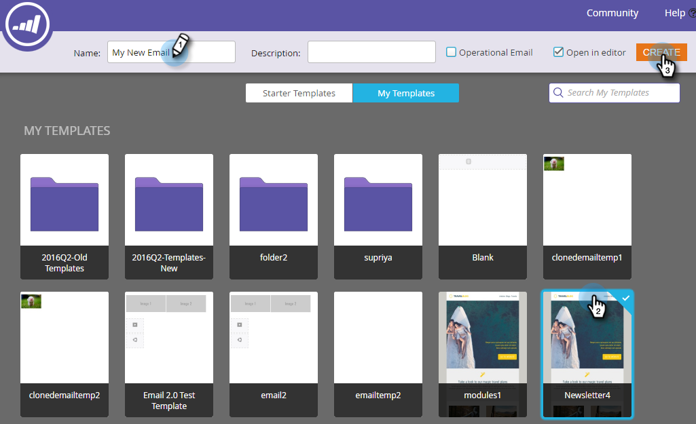

# 建立電子郵件{#create-an-email}

在Marketo中建立電子郵件的主要方式有兩種。 讓我們看看這兩個。

## 在Design Studio中建立電子郵件{#create-an-email-in-the-design-studio}

1. 前往&#x200B;**Design Studio**。

   

1. 按一下&#x200B;**新建**&#x200B;下拉式清單並選擇&#x200B;**新建電子郵件**。

   

   >[!NOTE]
   >
   >當您在Design Studio中建立電子郵件時，可在樹狀結構的「電子郵件」下找到。

簡單！ 現在換個角度說……

## 在行銷活動中建立電子郵件{#create-an-email-in-marketing-activities}

1. 前往&#x200B;**行銷活動**。

   

1. 選擇要將電子郵件添加到的程式，按一下&#x200B;**新建**&#x200B;下拉式清單並選擇&#x200B;**新建本地資產**。

   

1. 按一下&#x200B;**電子郵件**。

   

   就這樣！

您選擇的方法會帶您至範本選擇器。

1. 為您的電子郵件提供名稱，按一下您要使用的範本，然後按一下「建立&#x200B;**」。**

   

   >[!NOTE]
   >
   >您可以從一系列可立即使用的互動式電子郵件範本中選擇，或是先選擇&#x200B;**我的範本**，然後依照相同的步驟儲存的範本。

1. 輸入主旨行。 右邊有一個計數器，可讓您知道是否在建議的50個字元上限下。

   

   視您選擇的範本而定，您有不同的選項可編輯電子郵件。 對於包含模組的電子郵件，請查看[將模組添加到您的電子郵件](/help/marketo/product-docs/email-marketing/general/email-editor-2/add-modules-to-your-email.md)。

您的電子郵件現在已建立，請立即編輯！

>[!MORELIKETHIS]
>
>[編輯您的電子郵件標題](edit-your-email-header.md)
