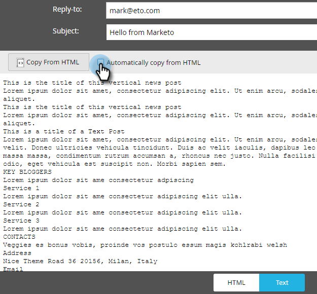

# 編輯電子郵件的文字版本 {#edit-the-text-version-of-an-email}

當您建立電子郵件時，可能會希望其文字版本的措辭與HTML版本不同。 依預設，Marketo會自動將您電子郵件中任何RTF元素的文字內容複製到文字版本。 以下是編輯方法。

>[!NOTE]
>
>這不是有關建立純文字電子郵件的文章。 如需相關資訊，請參閱 [建立純文字電子郵件](/help/marketo/product-docs/email-marketing/general/creating-an-email/create-a-text-only-email.md).

1. 在電子郵件編輯器中，按一下 **文字** 標籤。

   

1. 取消選中 **自動從HTML複製** 進行變更。

   

1. 按兩下文字區域。

   

1. 進行編輯。 完成後，只需關閉編輯器，或返回HTML版本。 變更會自動儲存。

   

   如果您只有靜態內容，文字將可編輯在一個大區塊中（如步驟3所示）。 如果您有動態內容，則文字會分割為不同的可編輯區段，如下所示。

   

現在你知道了！
