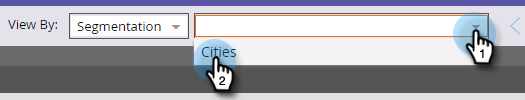
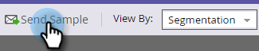

# 傳送範例電子郵件 {#send-a-sample-email}

可以快速輕鬆地傳送電子郵件範例。 若要傳送動態內容電子郵件，請參閱 [預覽包含動態內容的電子郵件](/help/marketo/product-docs/email-marketing/general/functions-in-the-editor/preview-an-email-with-dynamic-content.md).

>[!NOTE]
>
>您必須擁有 **Access資料庫 — 執行單一流程動作** 傳送範例電子郵件的許可權。

## 傳送範例電子郵件 {#send-a-sample-email-1}

1. 尋找並選取您的電子郵件。 按一下 **電子郵件動作** 下拉式清單並選取 **傳送範例**.\
   

   >[!NOTE]
   >
   >我的Token會解析為適用於電子郵件程式的值。

1. 輸入一個或多個電子郵件地址進行傳遞。 如果有多個電子郵件地址，請使用逗號加以區隔。 按一下 **傳送** 完成時。

   

   >[!IMPORTANT]
   >
   >如果您輸入多個電子郵件地址，則每個收件者都會看到這些地址。 輸入的第一位會是主要收件者，後續的每個電子郵件地址都會是副本收件者。

   >[!TIP]
   >
   >如果您想要以特定人員身分解析權杖，請在 **人員下拉式清單** 步驟2.

## 編輯時傳送範例電子郵件 {#send-a-sample-email-while-editing}

1. 尋找您的電子郵件，選取它並按一下 **編輯草稿** 標籤。

   

1. 按一下 **電子郵件動作**，選取 **傳送範例**.

   

1. 輸入傳遞的電子郵件地址，然後按一下 **傳送**.

   

   >[!NOTE]
   >
   >觸發器欄位僅適用於使用 [電子郵件指令碼](https://developers.marketo.com/documentation/velocity-script/).

## 根據區段傳送範例電子郵件 {#send-a-sample-email-based-on-a-segment}

>[!PREREQUISITES]
>
>[將區段套用至您的電子郵件](/help/marketo/product-docs/email-marketing/general/functions-in-the-editor/using-dynamic-content-in-an-email.md).

1. 尋找您的電子郵件，選取它並按一下 **編輯草稿** 標籤。

   

1. 按一下 **預覽**.

   

1. 按一下 **檢視方式** 下拉式清單並選取 **細分**.

   

1. 會出現一個下拉式清單，其中包含可用的區段。 按一下滑鼠左鍵並選取您需要的滑鼠左鍵。

   

1. 使用箭頭來捲動您的選項（在此情況下，我們會動態變更主旨行）。

   

1. 按一下 **傳送範例** 接收區段的實際運作測試電子郵件。

   

   >[!TIP]
   >
   >您也可以在電子郵件的編輯模式下，根據區段傳送範例電子郵件。 按一下 **電子郵件動作** 下拉式清單，選取 **傳送範例**，然後選擇您的區段。

在啟動行銷活動之前取樣您的內容非常重要。 測量兩次，剪下一次！
