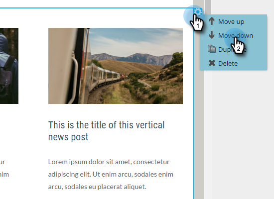

# 將模組添加到電子郵件 {#add-modules-to-your-email}

在Email Editor 2.0中，模組是範本中定義的電子郵件區段。 模組可包含元素、變數和其他HTML內容的任何組合。 將它們加入您的電子郵件很簡單。

1. 建立電子郵件。 請務必選擇（或建立）包含模組的範本。

   

   >[!NOTE]
   >
   >大部份的Marketo Starter範本都包含模組。 您也可以 [自行建立](http://docs.marketo.com/display/DOCS/Email+Template+Syntax#EmailTemplateSyntax-Modules)。

1. 在電子郵件最右側，按一下「模 **塊」**。

   

1. 選擇您要新增的模組，並將它拖曳至您的電子郵件。

   

1. 將模組拖曳到上方時，您會看到「拖曳到此處」出現在其他模組之間。 將新模組放在您想要的位置。

   

1. 等待幾秒，您的電子郵件就會自動重新整理，顯示您新增的模組。

   

## 在電子郵件中移動模組 {#moving-a-module-within-an-email}

移動模組有兩種方法。

1. 確定要移動的模組。 如果您不確定它的名稱，請將滑鼠指標暫留在它上方，並在右側反白顯示。

   

1. 將滑鼠指標暫留在右側的模組上，以顯示控制點。 抓住它……

   

1. ...並將模組拖動到所需位置。

   

1. 另一種方法是按一下電子郵件中的模組以選取它，並顯示齒輪圖示。

   

1. 按一下齒輪表徵圖，然後選 **擇「上移** 」 **或「下移**」，具體取決於模組的所在位置。

   

就這麼簡單。

>[!MORELIKETHIS]
>
>[電子郵件範本語法](email-template-syntax.md)

