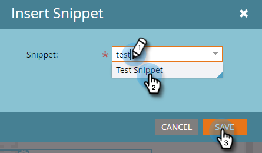
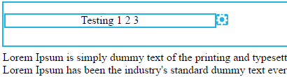

# 編輯電子郵件中的元素 {#edit-elements-in-an-email}

電子郵件可包含四個不同的元素：RTF文字、影像、代碼片段和視訊。 以下說明如何編輯每個。

## 如何編輯RTF元素 {#how-to-edit-the-rich-text-element}

1. 尋找您的電子郵件，選取並按一下 **編輯草稿**.

   

1. 將會開啟電子郵件編輯器。 選取RTF文字，按一下齒輪圖示並選取 **編輯**.

   

   您也可以將滑鼠游標停留在右側窗格中的元素上，以顯示齒輪圖示。

   

1. 新增/編輯您的文字，然後按下 **儲存**.

   

   >[!NOTE]
   >
   >您也可以新增影像、代號、表格和其他元素。 另請參閱 [使用RTF編輯器](/help/marketo/product-docs/email-marketing/general/understanding-the-email-editor/using-the-rich-text-editor.md).

   >[!CAUTION]
   >
   >避免從RTF文字來源（例如網站或Word檔案）複製和貼上文字。 請改為先將RTF文字貼到純文字編輯器中，例如Notepad (Windows)或TextEdit (Mac)。 當它變成「乾淨」後，您就可以從純文字編輯器複製它，並貼到您的電子郵件中。

## 如何編輯影像元素 {#how-to-edit-the-image-element}

1. 使用影像元素按一下模組內部以選取它。

   

1. 按一下您要編輯的影像元素，然後按一下齒輪圖示並選取 **編輯**.

   

   >[!NOTE]
   >
   >您也可以連按兩下元素以開始編輯。

1. 影像編輯器隨即顯示。

   

   您有三個插入影像的選項。 讓我們逐一看看。

   **外部URL**

   >[!NOTE]
   >
   >如果您想要使用Marketo Token，請使用此選項。 請記住，當您使用Token時，影像在編輯器中會顯示為損毀，但會在預覽模式和傳送範例電子郵件中呈現。

   若要使用外部URL，請先貼入影像的URL。 變更維度以符合您的需求，並新增一些替代文字（選擇性）。 然後按 **交換**.

   

   **我的電腦**

   若要從電腦上傳影像，請按一下 **瀏覽**.

   

   導覽至影像在電腦上的位置並插入。

   

   變更尺寸以符合您的需求，變更Alt文字（選擇性），然後按下 **交換**.

   

   >[!NOTE]
   >
   >如果您要取代影像，您必須檢查 **覆寫現有影像** 方塊，顯示在影像URL/名稱下方。

   **Design Studio**

   若要從Design Studio插入影像，只要找到它即可……

   

   ...並插入它。 變更尺寸以符合您的需求，變更Alt文字（選擇性），然後按下 **交換**.

   

## 如何編輯代碼片段元素 {#how-to-edit-the-snippet-element}

1. 使用Snippet元素在模組內按一下。

   

1. 按一下代碼片段元素，然後按一下齒輪圖示並選取 **編輯**.

   

1. 尋找您的程式碼片段、選取該程式碼片段，然後按一下 **儲存**.

   

1. 接著會填入您的程式碼片段。

   

## 如何編輯視訊元素 {#how-to-edit-the-video-element}

1. 使用Video元素在模組內按一下。

   

1. 按一下「視訊」元素，然後按一下齒輪圖示並選取 **編輯**.

   

1. 從Vimeo或YouTube貼上影片URL。 然後按一下移出URL方塊，即可載入預覽。 變更尺寸以符合您的需求，新增Alt文字（選擇性），然後按下 **插入**.

   

   >[!NOTE]
   >
   >若為YouTube影片，請使用位址列中的完整URL，而非在「共用」選項中找到的捷徑URL。

盡情設計完美的電子郵件！
