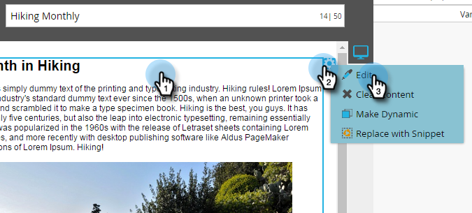
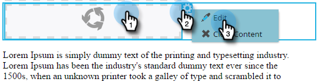

# 編輯電子郵件{#edit-elements-in-an-email}中的元素

電子郵件可包含四個不同的元素：豐富式文字、影像、程式碼片段和視訊。 以下是如何編輯每個項目。

## 如何編輯富格文本元素{#how-to-edit-the-rich-text-element}

1. 尋找您的電子郵件，選取它，然後按一下「編輯草稿」。****

   

1. 電子郵件編輯器將開啟。 選擇富格文本，按一下齒輪表徵圖，然後選擇&#x200B;**編輯**。

   

   您也可以將滑鼠指標暫留在右側窗格的元素上，使齒輪圖示出現。

   

1. 添加／編輯文本，然後按&#x200B;**保存**。

   

   >[!NOTE]
   >
   >**提醒**
   >
   >
   >您也可以新增影像、Token、表格和其他元素。 請參閱[使用Rich Text Editor](../../../../product-docs/email-marketing/general/understanding-the-email-editor/using-the-rich-text-editor.md)。

   >[!CAUTION]
   >
   >避免從豐富型文字來源（例如網站或Word檔案）複製和貼上文字。 而是先將豐富型文字貼入純文字編輯器，例如記事本(Windows)或TextEdit(Mac)。 一旦「乾淨」，您就可以從純文字編輯器複製並貼到您的電子郵件中。

## 如何編輯影像元素{#how-to-edit-the-image-element}

1. 在模組內按一下「影像」元素以選擇它。

   

1. 按一下要編輯的「影像」元素，然後按一下齒輪表徵圖，然後選擇「編輯」(Edit)**。**

   

   >[!NOTE]
   >
   >您也可以連按兩下元素以開始編輯。

1. 將顯示影像編輯器。

   

   您有三個插入影像的選項。 讓我們來看看每個。

   **外部URL**

   >[!NOTE]
   >
   >如果您想要使用Marketo Token，請使用此選項。 請記住，當您使用Token時，影像在編輯器中會顯示損毀，但會在「預覽」模式和「傳送範例」電子郵件中呈現。

   **交換** 

   **我的電腦**

   若要從電腦上傳影像，請按一下「瀏覽&#x200B;**」。**

   

   導覽至影像在您電腦上的位置，然後插入影像。

   

   變更尺寸以符合您的需求，變更Alt文字（可選），然後按&#x200B;**Swap**。

   

   >[!NOTE]
   >
   >如果您要取代影像，則需要勾選出「影像URL/名稱」下方的「覆寫現有的影像&#x200B;**」方塊。**

   **設計**&#x200B;工作室若要從Design Studio插入影像，只要找到它……

   

   **交換**
   

若要使用外部URL，請先貼入影像的URL。 變更尺寸以符合您的需求，並新增一些替代文字（選用）。 然後按。               ...並插入。 變更尺寸以符合您的需求，變更替代文字（選用），然後按。

## 如何編輯程式碼片段元素{#how-to-edit-the-snippet-element}

1. 在模組內按一下「程式碼片段」元素。

   

1. 按一下「程式碼片段」元素，然後齒輪圖示並選取「編輯」(**Edit)**。

   

1. 尋找程式碼片段，選取它，然後按一下「儲存」。****

   

1. 然後，您的程式碼片段就會填入。

   

## 如何編輯視訊元素{#how-to-edit-the-video-element}

1. 在模組內按一下「視訊」元素。

   

1. 按一下「Video（視頻）」元素，然後按一下齒輪表徵圖並選擇&#x200B;**Edit**。

   

1. 從Vimeo或YouTube貼入影片URL。 然後，按一下URL方塊外的，以載入預覽。 根據需要改變尺寸，添加Alt Text（可選），然後按&#x200B;**Insert**。

   

   >[!NOTE]
   >
   >對於YouTube影片，請使用位址列的完整URL，而非「分享」選項中的捷徑URL。

設計完美電子郵件的樂趣！
